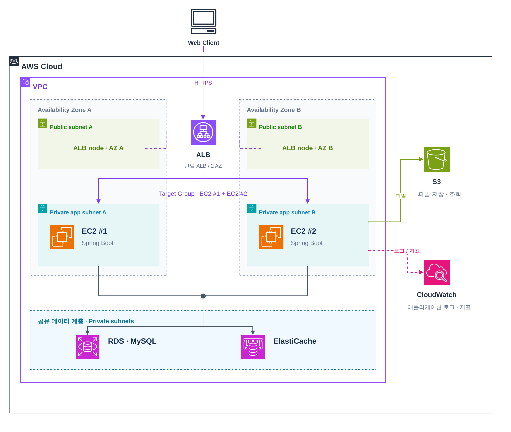

# GETDDO Backend

## 목차

1. [프로젝트 소개](#프로젝트-소개)
2. [개발 방식](#개발-방식)
3. [핵심 기능](#핵심-기능)
4. [기술 스택](#기술-스택)
5. [아키텍처](#아키텍처)
6. [ERD](#erd)
7. [패키지 구조](#패키지-구조)
8. [실행 방법](#실행-방법)

## 프로젝트 소개

GETDDO는 경품 이벤트를 소재로 한 **이벤트 응모 및 추첨 플랫폼**입니다. 출석·미션·게임으로 응모권을 모으고, 이벤트에 응모한 뒤 추첨 결과를 확인하는 흐름을 제공합니다.

이 저장소는 GETDDO의 백엔드입니다. 응모권 잔액과 이력의 정합성, 중복 요청 방지, 추첨 후보·조건·결과 보존을 중심으로 개발하고 있습니다. 가상 사용자와 더미 데이터로 시연하며, 외부 알림 발송은 모의 처리합니다.

프로젝트의 목표와 범위는 [공용 요구사항](https://github.com/GETDDO/getddo-spec/blob/main/00-requirements/README.md)을 기준으로 합니다.

## 개발 방식

프론트엔드와 백엔드는 별도 저장소에서 개발하고, 공용 요구사항·도메인 정책·협업 규칙은 [getddo-spec](https://github.com/GETDDO/getddo-spec)에서 관리합니다. 백엔드의 기능별 담당 영역과 공동 작업 경계는 [백엔드 기능 담당자](docs/01-conventions/backend-feature-assignments.md)를 따릅니다.

개발은 Jira 이슈 생성 → `dev` 기준 작업 브랜치 → 구현·테스트 → Pull Request → CI·코드 리뷰 → 병합 순서로 진행합니다. 상세 규칙은 다음 원본 문서를 확인합니다.

- [브랜치 전략](https://github.com/GETDDO/getddo-spec/blob/main/01-conventions/branch.md)
- [커밋 규칙](https://github.com/GETDDO/getddo-spec/blob/main/01-conventions/commit.md)
- [개발 흐름](https://github.com/GETDDO/getddo-spec/blob/main/01-conventions/workflow.md)
- [Pull Request 규칙](https://github.com/GETDDO/getddo-spec/blob/main/01-conventions/pull-request.md)
- [백엔드 코드 스타일](docs/01-conventions/code-style.md)
- [백엔드 문서와 작업 기록](docs/README.md)
- [이 저장소의 PR 템플릿](.github/pull_request_template.md)

## 핵심 기능

아래는 개발 중인 서비스의 주요 기능 범위입니다. 세부 정책과 구현·제외 범위는 [기능 요구사항](https://github.com/GETDDO/getddo-spec/blob/main/00-requirements/functional-requirements.md), [도메인 규칙](https://github.com/GETDDO/getddo-spec/blob/main/02-domain/README.md), [구현 범위](https://github.com/GETDDO/getddo-spec/blob/main/00-requirements/scope.md)를 확인합니다.

| 기능 | 내용 |
| --- | --- |
| 출석·미션·게임 | 일일·연속 출석, 퀴즈·설문, 게임 수행에 따른 응모권 보상 |
| 응모권 관리 | 응모권 잔액과 지급·차감·반환·회수·만료 이력 관리 |
| 이벤트·응모 | 이벤트와 경품 조회, 응모 조건 검증, 응모 접수와 내 응모 내역 조회 |
| 참여 검토·추첨 | 어뷰징 의심 건 검토, 추첨 후보·조건 보존, 가중치 추첨과 결과 발표 |
| 백오피스 | 이벤트·경품·배너·보상 정책 운영, 사용자·응모·감사 로그 조회 |
| 알림 | 이벤트와 처리 결과에 대한 사이트 내 알림, 읽음 상태 관리 |

## 기술 스택

| 구분 | 기술 |
| --- | --- |
| 언어 |  |
| 프레임워크 |   |
| 빌드 |  |
| 데이터베이스 |  |
| 캐시 · 도입 예정 |  |
| 영속성·마이그레이션 |   |
| 객체 매핑 |   |
| API 문서 |   |
| 테스트 |    |
| 실행 환경 |   |
| CI |  |

## 아키텍처

### 클라우드 아키텍처

[](docs/assets/cloud-architecture.png)

[draw.io 원본](docs/assets/cloud-architecture.drawio)

## ERD

[](https://raw.githubusercontent.com/wiki/GETDDO/getddo-be/assets/erd-2026-10-02/full.png)

[ERDCloud에서 확대·이동하며 보기](https://www.erdcloud.com/d/vuDvgmGQcvHf6f6g9) · [원본 이미지](https://raw.githubusercontent.com/wiki/GETDDO/getddo-be/assets/erd-2026-10-02/full.png)

### 도메인별 ERD

도메인을 선택하면 GitHub Wiki에서 해당 도메인의 전체 ERD와 테이블별 컬럼 표를 확인할 수 있습니다. 이미지를 누르면 원본 크기로 열립니다. [전체 Wiki 목록](https://github.com/GETDDO/getddo-be/wiki/ERD)에서도 도메인별로 이동할 수 있습니다.

| 도메인 | 테이블 수 | 내용 |
| --- | ---: | --- |
| [사용자](https://github.com/GETDDO/getddo-be/wiki/ERD-user) | 1 | 사용자 정보·역할·멤버십 |
| [이벤트·응모](https://github.com/GETDDO/getddo-be/wiki/ERD-event) | 5 | 이벤트·경품·응모자·응모 요청·배너 |
| [출석](https://github.com/GETDDO/getddo-be/wiki/ERD-attendance) | 5 | 일일·연속 출석과 보상 기록 |
| [미션](https://github.com/GETDDO/getddo-be/wiki/ERD-mission) | 10 | 퀴즈·설문·제출·보상 기록 |
| [게임](https://github.com/GETDDO/getddo-be/wiki/ERD-game) | 4 | 게임·플레이·통계·보상 기록 |
| [보상 정책](https://github.com/GETDDO/getddo-be/wiki/ERD-reward) | 1 | 출석·미션·게임의 보상 정책 |
| [응모권](https://github.com/GETDDO/getddo-be/wiki/ERD-ticket) | 5 | 지갑·원장·배분·반환·회수 |
| [어뷰징 검토](https://github.com/GETDDO/getddo-be/wiki/ERD-abuse) | 1 | 의심 행위 탐지와 관리자 검토 |
| [추첨·발표](https://github.com/GETDDO/getddo-be/wiki/ERD-drawing) | 6 | 추첨 실행·후보·결과·당첨·발표 |
| [알림](https://github.com/GETDDO/getddo-be/wiki/ERD-notification) | 2 | 알림 생성 작업과 사용자 알림 |
| [감사 로그](https://github.com/GETDDO/getddo-be/wiki/ERD-audit) | 1 | 변경 행위와 변경 전후 데이터 |

## 패키지 구조

하나의 Spring Boot 애플리케이션으로 실행하는 멀티모듈 구조입니다. 아래는 주요 디렉터리와 기능 추가 시 패키지 배치 기준입니다. `<도메인>`에는 `user`, `event`, `ticket` 등 기능별 패키지 이름이 들어갑니다.

```text
getddo-be/
├── api/                                         # HTTP 요청·응답과 애플리케이션 실행
│   ├── build.gradle                             # 웹·검증·API 문서 의존성
│   └── src/
│       ├── main/
│       │   ├── java/com/getddo/api/
│       │   │   ├── GetddoBeApplication.java     # Spring Boot 진입점
│       │   │   ├── common/                      # API 공통 처리
│       │   │   │   ├── config/                  # MVC·CORS·OpenAPI 설정
│       │   │   │   ├── context/                 # 사용자 문맥 어노테이션·ArgumentResolver
│       │   │   │   ├── exception/               # 공통 API 오류 코드·전역 예외 처리
│       │   │   │   └── response/                # 공통 응답 형식 ResponseEnvelope
│       │   │   └── <도메인>/
│       │   │       ├── controller/              # 요청을 받아 Service에 위임
│       │   │       ├── dto/request/             # 요청 DTO와 입력 검증
│       │   │       ├── dto/response/            # 응답 DTO
│       │   │       └── mapper/                  # 도메인 객체 → 응답 DTO 변환
│       │   └── resources/                       # application.yaml 등 실행 설정
│       ├── test/                                # DB 없는 API·설정 테스트
│       └── integrationTest/                     # 앱 기동·API·DB 연동 테스트
├── core/                                        # 도메인 모델과 비즈니스 규칙
│   ├── build.gradle                             # Spring Context·트랜잭션 의존성
│   └── src/
│       ├── main/java/com/getddo/core/
│       │   ├── common/                          # 공통 예외·페이지 조회 모델·시각 처리
│       │   └── <도메인>/
│       │       ├── domain/                      # 도메인 객체·상태·비즈니스 규칙
│       │       ├── service/                     # 업무 흐름과 트랜잭션
│       │       ├── repository/                  # 조회·저장 인터페이스
│       │       └── exception/                   # 도메인 오류 코드(ErrorCode 구현)
│       └── test/                                # 도메인 규칙·Service 테스트
├── storage/                                     # 영속성 모듈의 경로 구분
│   └── db/                                      # MySQL 영속성 구현
│       ├── build.gradle                         # JPA·Flyway·MySQL 드라이버 의존성
│       └── src/
│           ├── main/
│           │   ├── java/com/getddo/db/
│           │   │   ├── common/                  # 공통 Entity·JPA Auditing 설정
│           │   │   └── <도메인>/
│           │   │       ├── entity/              # DB 테이블에 대응하는 JPA Entity
│           │   │       ├── repository/          # JpaRepository·core Repository 구현
│           │   │       └── mapper/              # Entity ↔ 도메인 객체 변환
│           │   └── resources/db/migration/      # 도메인별 Flyway SQL
│           ├── test/                            # DB 없는 영속성 관련 테스트
│           ├── integrationTest/                 # 실제 MySQL·마이그레이션 검증
│           └── testFixtures/                    # 공유 Testcontainers 설정
├── .github/                                     # GitHub 협업·자동화 설정
│   ├── pull_request_template.md                 # PR 작성 양식
│   └── workflows/                               # 빌드·테스트·PR 제목 검사
├── docs/                                        # 백엔드 API·DB·결정·작업 기록
├── gradle/wrapper/                              # Gradle 실행 버전 고정
├── compose.yaml                                 # 로컬 앱·MySQL 컨테이너 구성
├── Dockerfile                                   # 애플리케이션 이미지 빌드
├── .env.example                                 # 로컬 환경변수 예시
├── build.gradle                                 # 모듈 공통 빌드·테스트 설정
├── settings.gradle                              # 프로젝트 이름·모듈 등록
├── gradlew                                      # macOS·Linux·WSL Gradle 실행
└── gradlew.bat                                  # Windows Gradle 실행
```

의존 방향은 `api → core`, `api → storage:db`, `storage:db → core`입니다. `api`만 실행 가능한 Spring Boot JAR을 만들고, 나머지 두 모듈은 라이브러리 JAR을 만듭니다. `core`는 API DTO나 JPA Entity에 의존하지 않습니다.

## 실행 방법

Docker Compose 실행에는 Docker가 필요합니다. 터미널에서 애플리케이션이나 Gradle 작업을 실행하려면 JDK 21도 준비합니다. Gradle은 저장소의 Wrapper를 사용합니다.

### Docker Compose

저장소 루트에서 `.env.example`을 `.env`로 복사하고 `DB_PASSWORD`, `MYSQL_ROOT_PASSWORD`에 각각 로컬 비밀번호를 입력합니다. DB 이름과 일반 계정은 예시의 `getddo`를 사용합니다. `.env`는 Git과 Docker 빌드 컨텍스트에서 제외됩니다.

```bash
docker compose up --build -d
```

앱은 `http://localhost:8080`, MySQL 8.4는 `localhost:3306`에서 접근할 수 있습니다. Compose는 `local` Spring 프로필을 활성화하고, `application-local.yaml`에 정의된 MySQL JDBC 연결에 DB 환경변수를 전달합니다. MySQL 데이터는 Compose 볼륨에 유지됩니다. 종료할 때는 `docker compose down`을 사용합니다.

앱 시작 시 Flyway가 `storage:db`의 도메인별 SQL V001~V011·V014를 버전 순서대로 적용합니다. V001~V011은 44개 테이블을 생성하고 V014는 알림 작업 조회용 인덱스를 추가합니다. 이벤트의 논리 삭제 시각, 출석 기준일·사용자별 하루 1회 UNIQUE와 외래 키는 각 테이블의 초기 생성 정의에 포함되어 있습니다. Docker Desktop을 WSL에서 사용하는 경우 WSL 연동을 활성화해야 합니다.

### 터미널

JDK 21을 준비하고 저장소 루트에서 실행합니다. 앱을 터미널에서 실행하려면 앞의 `.env` 준비 후 `docker compose up -d db`로 개발용 MySQL만 시작합니다. `bootRun`은 `.env`를 자동으로 읽지 않으므로 같은 DB 접속 정보를 환경변수로 지정합니다.

macOS / Linux / WSL:

```bash
export SPRING_PROFILES_ACTIVE=local
export DB_HOST=localhost DB_PORT=3306
export DB_NAME=getddo DB_USERNAME=getddo
export DB_PASSWORD='<.env에 설정한 DB_PASSWORD 값>'
./gradlew :api:bootRun
```

Windows PowerShell:

```powershell
$env:SPRING_PROFILES_ACTIVE = 'local'
$env:DB_HOST = 'localhost'
$env:DB_PORT = '3306'
$env:DB_NAME = 'getddo'
$env:DB_USERNAME = 'getddo'
$env:DB_PASSWORD = '<.env에 설정한 DB_PASSWORD 값>'
.\gradlew.bat :api:bootRun
```

DB 이름이나 계정을 바꿨다면 환경변수도 `.env`와 맞춥니다.

### 테스트와 CI

DB가 필요한 테스트는 Testcontainers가 실행하는 임시 MySQL 8.4를 사용합니다. 개발용 DB·`.env` 설정 없이 실행하며, 임의의 호스트 포트로 연결하고 테스트 종료 시 컨테이너를 정리합니다. H2는 사용하지 않습니다.

공통 설정은 `storage/db/src/testFixtures/java/com/getddo/db/support`에 있습니다. `MySqlTestContainers`는 호출마다 새 컨테이너를 만들고, `MySqlTestConfiguration`은 `@ServiceConnection`으로 Spring의 JDBC·Flyway 연결을 자동 설정합니다. Spring 테스트는 `test` 프로필을 사용하며 컨테이너 시작·종료는 Spring이 관리합니다. 이 설정은 통합 테스트에서만 사용하고 운영 실행 JAR에는 포함하지 않습니다.

API의 앱 기동·Swagger 테스트는 `api/src/integrationTest/java/com/getddo/api/support/ApiIntegrationTest.java`의 `@ApiIntegrationTest`를 사용해 동일한 Spring 컨텍스트와 MySQL 하나를 공유합니다. 공통 Entity 테스트는 테이블을 생성·삭제하는 별도 DB를 사용하고, 초기 SQL 테스트는 JUnit이 관리하는 별도 컨테이너의 빈 DB에서 실행합니다. 다른 모듈이나 서로 다른 Spring 컨텍스트까지 강제로 공유하지 않습니다.

통합 테스트 전에 Docker Desktop의 Linux 컨테이너 엔진을 실행합니다. WSL에서는 Settings → Resources → WSL Integration에서 사용하는 배포판을 켜고, `docker version`에 Client와 Server가 모두 표시되는지 확인합니다. 첫 실행에는 MySQL 이미지 다운로드가 필요합니다.

| 작업 | macOS / Linux / WSL | Windows PowerShell | Docker |
| --- | --- | --- | --- |
| DB 없는 테스트 | `./gradlew test` | `.\gradlew.bat test` | 불필요 |
| MySQL 통합 테스트 | `./gradlew integrationTest` | `.\gradlew.bat integrationTest` | 필요 |
| 초기 SQL·공통 Entity 검증 | `./gradlew :storage:db:integrationTest` | `.\gradlew.bat :storage:db:integrationTest` | 필요 |
| 앱 기동·Swagger 검증 | `./gradlew :api:integrationTest` | `.\gradlew.bat :api:integrationTest` | 필요 |
| 전체 빌드·테스트 | `./gradlew build` | `.\gradlew.bat build` | 필요 |
| 실행 JAR 패키징 | `./gradlew :api:bootJar` | `.\gradlew.bat :api:bootJar` | 불필요 |

초기 SQL 검증은 빈 MySQL에 Flyway 마이그레이션을 적용하고, 재실행 시 추가 적용이 없는지 확인합니다. Docker에 연결할 수 없으면 통합 테스트는 실패합니다.

GitHub Actions의 `빌드·테스트`는 러너의 Docker에서 같은 `./gradlew build`를 실행합니다. 별도 DB 비밀값 설정은 필요하지 않습니다. 실패한 테스트 보고서는 `test-reports` 아티팩트에서 확인할 수 있습니다.

`PR 제목 검사`는 [공용 PR 제목 규칙](https://github.com/GETDDO/getddo-spec/blob/main/01-conventions/pull-request.md)에 맞는지 별도로 확인합니다. PR 생성·수정·커밋 추가 시 실행하며, 제목·본문만 수정하면 Gradle 빌드는 실행하지 않습니다. 제목 오류로 병합을 막으려면 main/dev Ruleset의 필수 상태 검사에 `PR 제목 검사`를 등록합니다.
