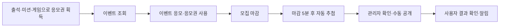
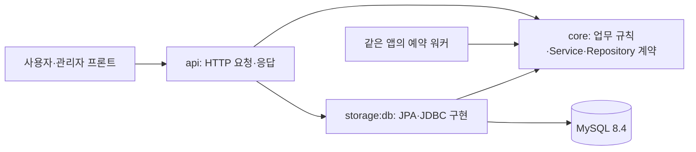
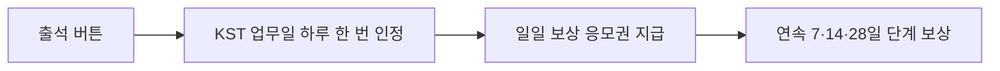
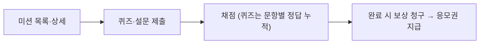
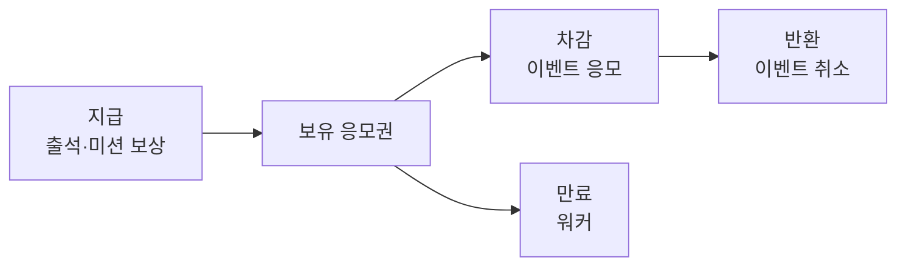
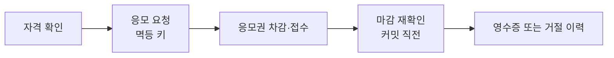
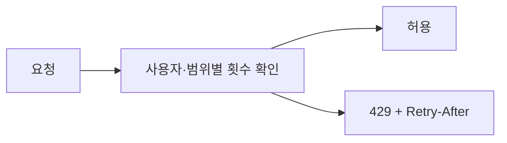

# GETDDO Backend

GETDDO는 응모권을 모아 경품 이벤트에 참여하고 추첨 결과를 확인하는 **이벤트 응모 및 추첨 플랫폼**입니다.

### 목차

1. [기술 스택](#기술-스택)
2. [프로젝트 개요](#프로젝트-개요)
3. [프로젝트 팀 구성 및 역할](#프로젝트-팀-구성-및-역할)
4. [아키텍처와 패키지 구조](#아키텍처와-패키지-구조)
5. [ERD](#erd)
6. [프로젝트 수행 경과](#프로젝트-수행-경과)
7. [실행 방법](#실행-방법)

## 기술 스택

| 구분 | 기술 |
| --- | --- |
| 언어 |  |
| 프레임워크 |   |
| 빌드 |  |
| 데이터베이스 |  |
| 캐시 · 도입 예정 |  |
| 영속성·마이그레이션 |   |
| 객체 매핑 |   |
| API 문서 |   |
| 테스트 |    |
| 실행 환경 |   |
| CI |  |

## 프로젝트 개요

### 서비스 소개와 기획 배경

커머스의 경품 이벤트는 사용자의 참여를 유도하는 동시에 응모권 지급·사용 이력과 추첨 결과에 대한 신뢰가 필요한 기능입니다. GETDDO는 이 과제를 주제로 출석·미션·게임에서 이벤트 참여와 운영자용 백오피스까지 이어지는 서비스를 개발합니다.

사용자가 보는 참여 화면뿐 아니라 중복 요청, 동시 응모, 응모권 반환, 추첨 근거 보존과 실패 복구를 함께 다룹니다. 기획의 기준은 [공용 요구사항](https://github.com/Uplus-GETDDO/getddo-spec/blob/main/00-requirements/README.md)입니다.

### 프로젝트 목표

| 목표 | 확인할 내용 |
| --- | --- |
| 참여형 이벤트 경험 | 활동으로 응모권을 얻고 이벤트 조회·응모·결과 확인으로 이어지는 사용자 흐름 |
| 응모권의 일관성 | 지급·차감·반환·만료 이력과 현재 응모권 상태의 일치 |
| 신뢰할 수 있는 응모·추첨 | 중복 접수·중복 당첨 방지와 후보·가중치·조건·확정 결과 보존 |
| 운영 가능한 서비스 | 관리자 이벤트·경품 관리, 취소 처리, 알림과 실패 재처리 |

### 주요 서비스 흐름


```mermaid
flowchart LR
    Earn["출석·미션·게임으로 응모권 획득"] --> Browse["이벤트 조회"]
    Browse --> Enter["이벤트 응모·응모권 사용"]
    Enter --> Close["모집 마감"]
    Close --> Draw["마감 5분 후 자동 추첨"]
    Draw --> Review["관리자 확인·수동 공개"]
    Review --> Result["사용자 결과 확인·알림"]
```

이 그림은 목표 서비스 흐름입니다. 기능별 구현·검증·연동 현황은 [프로젝트 수행 경과](#프로젝트-수행-경과)에 각 도메인 담당자가 작성합니다. 응모권 미사용 이벤트도 있으며, 모든 이벤트가 응모권을 차감하는 것은 아닙니다. 추첨 실행과 사용자에게 결과를 공개하는 시점은 분리합니다.

## 프로젝트 팀 구성 및 역할

### 팀원 소개와 담당 영역

| 팀원 | 담당 영역 | 주요 기능 |
| --- | --- | --- |
| 이경주 | 인프라·공통 기반·사용자 | 실행·배포 환경, 공통 응답·오류·시간·감사 기록, 사용자·역할·멤버십 |
| 석종수 | 어뷰징 차단 기록·추첨 | 지급 전 차단 근거 기록, 후보·가중치 스냅샷, 추첨·당첨 취소·재추첨·결과 공개 |
| 전민규 | 백오피스·알림·게임 | 관리자 운영 기능, 배너·정책 관리, 알림 생성·발송·복구, 게임 검증·보상 자격 |
| 윤태형 | 응모권·미션·출석·응모 | 응모권 지급·차감·반환·만료, 출석·미션 보상, 응모 접수·내역 |
| 박지훈 | 이벤트·경품 관리·이벤트 취소 | 사용자·관리자 이벤트 조회, 이벤트·경품 CRUD, 시작·마감 전환, 취소 연동 |

담당 영역은 구현 책임을 나타내며 완료 현황을 의미하지 않습니다. 상세 경계는 [백엔드 기능 담당자](docs/01-conventions/backend-feature-assignments.md)를 확인합니다.

## 아키텍처와 패키지 구조

### 전체 아키텍처

단일 Spring Boot 애플리케이션으로 실행하는 멀티모듈 구조이며, 각 모듈 안을 기능별 패키지로 나눕니다.


```mermaid
flowchart LR
    Client["사용자·관리자 프론트"] --> API["api: HTTP 요청·응답"]
    API --> Core["core: 업무 규칙·Service·Repository 계약"]
    API --> DB["storage:db: JPA·JDBC 구현"]
    DB --> Core
    DB --> MySQL[("MySQL 8.4")]
    Worker["같은 앱의 예약 워커"] --> Core
```

### 클라우드 설계도

[](docs/assets/cloud-architecture.drawio)

[draw.io 원본](docs/assets/cloud-architecture.drawio). Vercel이 프론트 화면 파일을 전달하고, 브라우저가 CloudFront를 통해 API와 이미지를 요청하는 구성입니다. EC2 2대와 공유 RDS·Redis를 포함한 확장 설계이며, 실제 두 서버 운영과 앱 연동 완료를 뜻하지 않습니다. 실제 배포 검증 상태는 [배포 문서](docs/06-runbook/container-cd.md)를 확인합니다.

### 모듈 의존 관계

api → core, api → storage:db, storage:db → core는 빌드 의존 방향입니다. 실제 업무 서비스는 Repository 인터페이스를 통해 주입된 저장 구현을 호출합니다. 모듈을 별도 서버로 배포하는 구조는 아닙니다.

| 구분 | 역할·사용 이유 |
| --- | --- |
| api | HTTP DTO·형식 검증·공통 사용자 문맥·응답 변환을 업무 규칙과 분리 |
| core | API와 워커가 업무 규칙·트랜잭션을 재사용. Spring Context/Transaction 의존성은 허용 |
| storage:db | Entity·JPA/JDBC·잠금·쿼리·마이그레이션을 저장 책임에 모음 |

이벤트 시작·마감과 응모권 만료는 각각 전용 스레드를 사용합니다. 알림·추첨은 DB 작업 상태·소유권 만료·재시도로 중복 처리와 장애 복구를 관리합니다. [Wiki 전체 아키텍처](https://github.com/Uplus-GETDDO/getddo-be/wiki/Mentoring-Architecture)에 호출 흐름·트랜잭션과 워커 경계를 설명했습니다.

### 패키지 구조

하나의 Spring Boot 애플리케이션으로 실행하는 멀티모듈 구조입니다. 아래는 주요 디렉터리와 기능 추가 시 패키지 배치 기준입니다. `<도메인>`에는 `user`, `event`, `ticket` 등 기능별 패키지 이름이 들어갑니다.

```text
getddo-be/
├── api/                                         # HTTP 요청·응답과 애플리케이션 실행
│   ├── build.gradle                             # 웹·검증·API 문서 의존성
│   └── src/
│       ├── main/
│       │   ├── java/com/getddo/api/
│       │   │   ├── GetddoBeApplication.java     # Spring Boot 진입점
│       │   │   ├── common/                      # API 공통 처리
│       │   │   │   ├── config/                  # MVC·CORS·OpenAPI 설정
│       │   │   │   ├── context/                 # 사용자 문맥 어노테이션·ArgumentResolver
│       │   │   │   ├── exception/               # 공통 API 오류 코드·전역 예외 처리
│       │   │   │   └── response/                # 공통 응답 형식 ResponseEnvelope
│       │   │   └── <도메인>/
│       │   │       ├── controller/              # 요청을 받아 Service에 위임
│       │   │       ├── dto/request/             # 요청 DTO와 입력 검증
│       │   │       └── dto/response/            # 응답 DTO·from(domain) 변환
│       │   └── resources/                       # application.yaml 등 실행 설정
│       ├── test/                                # DB 없는 API·설정 테스트
│       └── integrationTest/                     # 앱 기동·API·DB 연동 테스트
├── core/                                        # 도메인 모델과 비즈니스 규칙
│   ├── build.gradle                             # Spring Context·트랜잭션 의존성
│   └── src/
│       ├── main/java/com/getddo/core/
│       │   ├── common/                          # 공통 예외·페이지 조회 모델·시각 처리
│       │   └── <도메인>/
│       │       ├── domain/                      # 도메인 객체·상태·비즈니스 규칙
│       │       ├── service/                     # 업무 흐름과 트랜잭션
│       │       ├── repository/                  # 조회·저장 인터페이스
│       │       └── exception/                   # 도메인 오류 코드(ErrorCode 구현)
│       └── test/                                # 도메인 규칙·Service 테스트
├── storage/                                     # 영속성 모듈의 경로 구분
│   └── db/                                      # MySQL 영속성 구현
│       ├── build.gradle                         # JPA·Flyway·MySQL 드라이버 의존성
│       └── src/
│           ├── main/
│           │   ├── java/com/getddo/db/
│           │   │   ├── common/                  # 공통 Entity·JPA Auditing 설정
│           │   │   └── <도메인>/
│           │   │       ├── entity/              # DB 테이블에 대응하는 JPA Entity
│           │   │       ├── repository/          # JpaRepository·core Repository 구현
│           │   │       └── mapper/              # Entity ↔ 도메인 객체 변환
│           │   └── resources/db/migration/      # 도메인별 Flyway SQL
│           ├── test/                            # DB 없는 영속성 관련 테스트
│           ├── integrationTest/                 # 실제 MySQL·마이그레이션 검증
│           └── testFixtures/                    # 공유 Testcontainers 설정
├── .github/                                     # GitHub 협업·자동화 설정
│   ├── pull_request_template.md                 # PR 작성 양식
│   └── workflows/                               # 빌드·테스트·PR 제목 검사
├── docs/                                        # 백엔드 API·DB·결정·작업 기록
├── gradle/wrapper/                              # Gradle 실행 버전 고정
├── compose.yaml                                 # 로컬 앱·MySQL 컨테이너 구성
├── Dockerfile                                   # 애플리케이션 이미지 빌드
├── .env.example                                 # 로컬 환경변수 예시
├── build.gradle                                 # 모듈 공통 빌드·테스트 설정
├── settings.gradle                              # 프로젝트 이름·모듈 등록
├── gradlew                                      # macOS·Linux·WSL Gradle 실행
└── gradlew.bat                                  # Windows Gradle 실행
```

### 기능 추가 시 패키지 배치

새 기능의 HTTP DTO·Controller는 `api`, 업무 서비스·모델·Repository 계약은 `core`, Entity·저장 구현·Mapper는 `storage:db`의 같은 기능 패키지에 둡니다. 도메인 오류 코드는 `core/<도메인>/exception`에 배치하고 기존 공통 응답·페이지·시간 기능을 재사용합니다.

의존 방향은 `api → core`, `api → storage:db`, `storage:db → core`입니다. `api`만 실행 가능한 Spring Boot JAR을 만들고, 나머지 두 모듈은 라이브러리 JAR을 만듭니다. `core`는 API DTO나 JPA Entity에 의존하지 않습니다.

## ERD

아래 이미지는 2026-10-16에 제공된 ERDCloud 전체 캡처입니다. 이미지를 누르면 원본 크기로 확인할 수 있습니다. 실제 적용 스키마는 전체 Flyway 적용 결과를 기준으로 확인합니다.

[](docs/assets/erd-2026-10-16.png)

[ERDCloud에서 확대·이동하며 보기](https://www.erdcloud.com/d/vuDvgmGQcvHf6f6g9) · [원본 이미지](docs/assets/erd-2026-10-16.png)

### 도메인별 ERD

도메인을 선택하면 GitHub Wiki에서 해당 도메인의 전체 ERD와 테이블별 컬럼 표를 확인할 수 있습니다. 이미지를 누르면 원본 크기로 열립니다. [전체 Wiki 목록](https://github.com/Uplus-GETDDO/getddo-be/wiki/ERD)에서도 도메인별로 이동할 수 있습니다.

도메인별 Wiki와 아래 테이블 수는 기존 2026-10-02 스냅샷 기준으로, 위 전체 ERD 캡처와 기준 시점이 다릅니다.

| 도메인 | 테이블 수 | 내용 |
| --- | ---: | --- |
| [사용자](https://github.com/Uplus-GETDDO/getddo-be/wiki/ERD-user) | 1 | 사용자 정보·역할·멤버십 |
| [이벤트·응모](https://github.com/Uplus-GETDDO/getddo-be/wiki/ERD-event) | 5 | 이벤트·경품·응모자·응모 요청·배너 |
| [출석](https://github.com/Uplus-GETDDO/getddo-be/wiki/ERD-attendance) | 5 | 일일·연속 출석과 보상 기록 |
| [미션](https://github.com/Uplus-GETDDO/getddo-be/wiki/ERD-mission) | 10 | 퀴즈·설문·제출·보상 기록 |
| [게임](https://github.com/Uplus-GETDDO/getddo-be/wiki/ERD-game) | 4 | 게임·플레이·통계·보상 기록 |
| [보상 정책](https://github.com/Uplus-GETDDO/getddo-be/wiki/ERD-reward) | 1 | 출석·미션·게임의 보상 정책 |
| [응모권](https://github.com/Uplus-GETDDO/getddo-be/wiki/ERD-ticket) | 2 | 응모권 한 장의 현재 상태와 처리 이력 |
| [어뷰징 검토](https://github.com/Uplus-GETDDO/getddo-be/wiki/ERD-abuse) | 1 | 의심 행위 탐지와 관리자 검토 |
| [추첨·발표](https://github.com/Uplus-GETDDO/getddo-be/wiki/ERD-drawing) | 6 | 추첨 실행·후보·결과·당첨·발표 |
| [알림](https://github.com/Uplus-GETDDO/getddo-be/wiki/ERD-notification) | 2 | 알림 생성 작업과 사용자 알림 |
| [감사 로그](https://github.com/Uplus-GETDDO/getddo-be/wiki/ERD-audit) | 1 | 변경 행위와 변경 전후 데이터 |

## 프로젝트 수행 경과

각 도메인 담당자가 아래 항목을 펼쳐 직접 작성합니다. 구현 기능, 설계·기술 선택의 이유, 문제 해결 과정, 실제 테스트 결과와 남은 작업을 정리합니다. **코드 구현·배포·프론트 연동 상태를 구분**하고 검증 결과에는 실행일과 기준 커밋을 함께 적습니다.

<!-- 아래 작성 틀을 담당자의 실제 수행 내용으로 교체한다. 다른 담당자의 구현·완료 상태를 대신 확정하지 않는다. -->

<details>
<summary>인프라·공통 기반</summary>

<!-- 작성 담당: 이경주 -->

담당자 작성 예정입니다.

- **구현 기능·시연 흐름**: 작성 예정
- **설계·기술 선택과 사용 이유**: 작성 예정
- **문제와 해결 과정**: 작성 예정
- **테스트 결과**: 실행일·기준 커밋·명령·성공/실패·검증 범위 작성 예정

기존 참고 자료: [Wiki](https://github.com/Uplus-GETDDO/getddo-be/wiki/Mentoring-Architecture) — 해당 문서의 기준 시점과 현재 구현을 확인한 뒤 작성합니다.

</details>

<details>
<summary>사용자</summary>

<!-- 작성 담당: 이경주 -->

담당자 작성 예정입니다.

- **구현 기능·시연 흐름**: 작성 예정
- **설계·기술 선택과 사용 이유**: 작성 예정
- **문제와 해결 과정**: 작성 예정
- **테스트 결과**: 실행일·기준 커밋·명령·성공/실패·검증 범위 작성 예정

기존 참고 자료: [Wiki](https://github.com/Uplus-GETDDO/getddo-be/wiki/Mentoring-Features#user) — 해당 문서의 기준 시점과 현재 구현을 확인한 뒤 작성합니다.

</details>

<details>
<summary>이벤트·경품 관리·이벤트 취소</summary>

<!-- 작성 담당: 박지훈 -->

> 작성 초안 — 담당자 확인 전. 구현 설명은 dev `94ce322b`, 테스트 기록은 아래 별도 기준 커밋을 따릅니다.

**구현 기능·시연 흐름**

- 사용자·관리자 이벤트 목록·상세 조회, 상태·유형 필터와 페이지 조회를 제공합니다. 관리자 검색은 KST 날짜 범위와 모집 기간이 겹치는 이벤트를 조회합니다.
- 이벤트 등록 시 경품을 함께 저장하고, 등수별 경품 종류·당첨 인원·멤버십·응모 조건을 검증합니다. 이벤트·경품 이미지 키는 선택값입니다.
- 시작 전 진행 예정 이벤트의 설정과 경품을 수정합니다. 시작 시각 앞당김을 막고 기존 경품 ID를 유지합니다.
- 시작 전이며 응모 이력이 없는 이벤트는 논리 삭제합니다. 배너는 관리자가 별도로 삭제합니다.
- 이벤트 취소 시 취소 상태·응모권 반환·취소 알림 작업 등록·감사 기록을 연결합니다. 이미 취소된 이벤트의 재요청은 409로 거절합니다.
- 전용 워커가 시작·마감 시각에 모집 상태를 전환합니다. 관리자 응답의 drawScheduledAt은 마감 +5분 자동 추첨 기준이며 실제 결과 공개 시각과 구분합니다.

**설계·기술 선택과 사용 이유**

- 조회는 JDBC로 검색·공개 상태 조건을 표현하고, 변경은 JPA와 이벤트 행 잠금으로 관리합니다.
- 이벤트·경품 저장과 감사 기록, 취소·반환은 업무 트랜잭션으로 묶어 일부만 완료되는 상황을 막습니다.
- 상태 전환은 이벤트별 트랜잭션과 SKIP LOCKED를 사용해 워커 경합과 개별 실패를 분리합니다.

**문제와 해결 과정**

- 잠금 대기 중 시작 시각이 지날 수 있어 잠금 획득 후 시각·상태를 다시 검사하도록 보완했습니다.
- 경품 등수 교환 시 UNIQUE 충돌을 피하도록 같은 트랜잭션에서 임시 등수를 거쳐 변경하고 기존 경품 ID를 보존했습니다.
- 한 이벤트의 감사 저장 실패가 후속 이벤트 전환을 막지 않도록 이벤트별 롤백과 순환 조회를 적용했습니다.

**테스트 결과**

- 2026-10-16 KST, dev `15f2d95c`의 전체 `test build --continue --offline --no-daemon --init-script gradle/test-limits.init.gradle --max-workers=1 --no-parallel` 실행에서 event 패키지 **255개**(단위·MVC·설정 131 / MySQL 통합 124)가 성공했습니다. 실패·오류·건너뜀은 0개입니다.
- 등록·수정·삭제·취소 조건, 잠금 경합, 감사·저장 실패 롤백과 워커 상태 전환을 검증했습니다. 이번 README 재구성에서는 테스트를 재실행하지 않았습니다.
- 집계·원본 자료: [Wiki 테스트 결과](https://github.com/Uplus-GETDDO/getddo-be/wiki/Mentoring-Tests).

상세 구현: [수정](docs/02-api/event-modification.md) · [삭제](docs/02-api/event-deletion.md) · [취소](docs/02-api/event-cancellation.md) · [모집 상태 전환·감사](docs/02-api/event-lifecycle-and-audit.md)

</details>

<details>
<summary>출석</summary>

<!-- 작성 담당: 윤태형 -->

**구현 기능·시연 흐름**


```mermaid
flowchart LR
    Press["출석 버튼"] --> Day["KST 업무일 하루 한 번 인정"]
    Day --> Daily["일일 보상 응모권 지급"]
    Daily --> Streak["연속 7·14·28일 단계 보상"]
```

같은 날 다시 눌러도 새로 기록하거나 지급하지 않고 확정된 결과를 돌려준다.

**설계·기술 선택과 사용 이유**

- 출석 기록·보상 청구·응모권 지급을 한 트랜잭션에서 확정해 "출석은 됐는데 보상이 빠지는" 일을 막고, 같은 날 동시 요청은 `(사용자, 출석일)` UNIQUE와 새 트랜잭션 1회 재처리로 처리한다.

**문제와 해결 과정**

- 같은 날 연타·동시 요청과 자정 경계에서의 이중 지급 위험을 UNIQUE 제약과 요청 시각 고정(한 번만 읽음)으로 막았다.

자세한 표·시퀀스·측정 근거: [Wiki](https://github.com/Uplus-GETDDO/getddo-be/wiki/Mentoring-Domain-Flows#출석)

</details>

<details>
<summary>미션</summary>

<!-- 작성 담당: 윤태형 -->

**구현 기능·시연 흐름**


```mermaid
flowchart LR
    List["미션 목록·상세"] --> Submit["퀴즈·설문 제출"]
    Submit --> Grade["채점 (퀴즈는 문항별 정답 누적)"]
    Grade --> Reward["완료 시 보상 청구 → 응모권 지급"]
```

이미 완료한 미션을 다시 제출해도 추가 보상은 없다.

**설계·기술 선택과 사용 이유**

- 제출 ID(`Idempotency-Key`)를 PK로 써서 별도 멱등 테이블 없이 동시 요청을 직렬화하고, 재전송이 같은 요청인지는 처음 요청의 SHA-256 해시로 판정한다. 지급이 실패하면 제출·답변·청구가 모두 롤백된다.

**문제와 해결 과정**

- 완료한 문항의 답변은 저장하지 않아 저장된 답변으로는 처음 요청을 복원할 수 없었다 → 처음 요청의 해시를 저장하도록 했다.

자세한 표·시퀀스·측정 근거: [Wiki](https://github.com/Uplus-GETDDO/getddo-be/wiki/Mentoring-Domain-Flows#미션)

</details>

<details>
<summary>응모권</summary>

<!-- 작성 담당: 윤태형 -->

**구현 기능·시연 흐름**


```mermaid
flowchart LR
    Grant["지급<br/>출석·미션 보상"] --> Hold["보유 응모권"]
    Hold --> Use["차감<br/>이벤트 응모"]
    Use --> Refund["반환<br/>이벤트 취소"]
    Hold --> Expire["만료<br/>워커"]
```

응모권 한 장은 `tickets` 한 행이고, 상태가 바뀔 때마다 `ticket_histories`에 이력을 한 줄 추가한다.

**설계·기술 선택과 사용 이유**

- 후보는 잠그지 않고 읽고 PK로 한 장씩 잠가 격리 수준과 무관하게 같은 동작을 하고, 반환은 상태가 이상할 때만 반환 이력을 잠금 읽기해 교착을 피한다. 만료는 `SKIP LOCKED`로 서버 여러 대의 워커가 겹쳐도 중복 만료하지 않는다.

**문제와 해결 과정**

- 반환 이력을 항상 잠금 읽기로 보자 서로 다른 사용자의 동시 반환이 `REPEATABLE_READ`에서 교착했다. 교착 기록으로 원인을 확인하고 상태가 이상할 때만 확인하도록 좁혔다.

**테스트 결과 (직접 측정)**

- 반환 이력 잠금 읽기: 대안은 60회 중 60회 교착, 채택한 방식은 0회. 만료 워커 4대: `SKIP LOCKED` 약 3.5초, 일반 `FOR UPDATE` 20.9초. (로컬 단일 머신의 상대 비교)

자세한 표·시퀀스·측정 근거: [Wiki](https://github.com/Uplus-GETDDO/getddo-be/wiki/Mentoring-Domain-Flows#응모권)

</details>

<details>
<summary>이벤트 응모</summary>

<!-- 작성 담당: 윤태형 -->

**구현 기능·시연 흐름**


```mermaid
flowchart LR
    Check["자격 확인"] --> Enter["응모 요청<br/>멱등 키"]
    Enter --> Deduct["응모권 차감·접수"]
    Deduct --> Close["마감 재확인<br/>커밋 직전"]
    Close --> Receipt["영수증 또는 거절 이력"]
```

같은 키로 다시 보내면 최초 결과를 돌려주고, 업무 거절은 `REJECTED`로 남겨 같은 오류를 돌려준다.

**설계·기술 선택과 사용 이유**

- 이벤트 행은 `FOR SHARE`로 읽어 응모끼리 서로 막지 않고, 마감은 차감 뒤와 커밋 직전에 두 번 확인한다. 거절 이력은 롤백과 분리하려고 `REQUIRES_NEW`로 기록한다.

**문제와 해결 과정**

- 마감 직후 커밋된 응모가 추첨 후보가 될 수 있어 커밋 직전 확인을 추가했고, 남는 짧은 간격은 공용 명세의 예외로 승인했다.

**테스트 결과 (직접 측정)**

- 같은 이벤트에 64명이 동시 응모할 때 `FOR SHARE`(채택) 102건/초, `FOR UPDATE` 23건/초로 **약 4.4배** 차이. (로컬 단일 머신의 상대 비교)

자세한 표·시퀀스·측정 근거: [Wiki](https://github.com/Uplus-GETDDO/getddo-be/wiki/Mentoring-Domain-Flows#이벤트-응모)

</details>

<details>
<summary>요청 빈도 제한</summary>

<!-- 작성 담당: 윤태형 -->

**구현 기능·시연 흐름**


```mermaid
flowchart LR
    Req["요청"] --> Count["사용자·범위별 횟수 확인"]
    Count --> Ok["허용"]
    Count --> Deny["429 + Retry-After"]
```

응모·출석·미션 제출·게임 결과 제출에 적용하며, 거절은 DB 작업보다 먼저 일어난다.

**설계·기술 선택과 사용 이유**

- 서버 메모리 구현은 서버가 한 대일 때만 정확해 `RateLimiter` 인터페이스 뒤에서 저장소를 고르게 했다. Redis 구현(PR #107, 리뷰 중)은 Lua 스크립트로 서버 여러 대의 횟수를 하나로 센다.

**문제와 해결 과정**

- 서버가 여러 대이면 한도가 서버마다 따로 적용되던 한계를 Redis 구현으로 해결하고 있다.

자세한 표·시퀀스: [Wiki](https://github.com/Uplus-GETDDO/getddo-be/wiki/Mentoring-Domain-Flows#요청-빈도-제한)

</details>

<details>
<summary>추첨·결과 공개</summary>

<!-- 작성 담당: 석종수 -->

담당자 작성 예정입니다.

- **구현 기능·시연 흐름**: 작성 예정
- **설계·기술 선택과 사용 이유**: 작성 예정
- **문제와 해결 과정**: 작성 예정
- **테스트 결과**: 실행일·기준 커밋·명령·성공/실패·검증 범위 작성 예정

기존 참고 자료: [Wiki](https://github.com/Uplus-GETDDO/getddo-be/wiki/Mentoring-Features#drawing) — 해당 문서의 기준 시점과 현재 구현을 확인한 뒤 작성합니다.

</details>

<details>
<summary>지급 전 어뷰징 차단 기록</summary>

<!-- 작성 담당: 석종수 -->

담당자 작성 예정입니다.

- **구현 기능·시연 흐름**: 작성 예정
- **설계·기술 선택과 사용 이유**: 작성 예정
- **문제와 해결 과정**: 작성 예정
- **테스트 결과**: 실행일·기준 커밋·명령·성공/실패·검증 범위 작성 예정

</details>

<details>
<summary>알림</summary>

<!-- 작성 담당: 전민규 -->

담당자 작성 예정입니다.

- **구현 기능·시연 흐름**: 작성 예정
- **설계·기술 선택과 사용 이유**: 작성 예정
- **문제와 해결 과정**: 작성 예정
- **테스트 결과**: 실행일·기준 커밋·명령·성공/실패·검증 범위 작성 예정

기존 참고 자료: [Wiki](https://github.com/Uplus-GETDDO/getddo-be/wiki/Mentoring-Features#notification) — 해당 문서의 기준 시점과 현재 구현을 확인한 뒤 작성합니다.

</details>

<details>
<summary>게임</summary>

<!-- 작성 담당: 전민규 -->

담당자 작성 예정입니다.

- **구현 기능·시연 흐름**: 작성 예정
- **설계·기술 선택과 사용 이유**: 작성 예정
- **문제와 해결 과정**: 작성 예정
- **테스트 결과**: 실행일·기준 커밋·명령·성공/실패·검증 범위 작성 예정

기존 참고 자료: [Wiki](https://github.com/Uplus-GETDDO/getddo-be/wiki/Mentoring-Features#game) — 해당 문서의 기준 시점과 현재 구현을 확인한 뒤 작성합니다.

</details>

<details>
<summary>백오피스·배너</summary>

<!-- 작성 담당: 전민규 -->

담당자 작성 예정입니다.

- **구현 기능·시연 흐름**: 작성 예정
- **설계·기술 선택과 사용 이유**: 작성 예정
- **문제와 해결 과정**: 작성 예정
- **테스트 결과**: 실행일·기준 커밋·명령·성공/실패·검증 범위 작성 예정

</details>

## 실행 방법

Docker Compose 실행에는 Docker가 필요합니다. 터미널에서 애플리케이션이나 Gradle 작업을 실행하려면 JDK 21도 준비합니다. Gradle은 저장소의 Wrapper를 사용합니다.

### Docker Compose

저장소 루트에서 `.env.example`을 `.env`로 복사하고 `DB_PASSWORD`, `MYSQL_ROOT_PASSWORD`에 각각 로컬 비밀번호를 입력합니다. DB 이름과 일반 계정은 예시의 `getddo`를 사용합니다. `.env`는 Git과 Docker 빌드 컨텍스트에서 제외됩니다.

```bash
docker compose up --build -d
```

앱은 `http://localhost:8080`, MySQL 8.4는 `localhost:3306`에서 접근할 수 있습니다. Compose는 `local` Spring 프로필을 활성화하고, `application-local.yaml`에 정의된 MySQL JDBC 연결에 DB 환경변수를 전달합니다. MySQL 데이터는 Compose 볼륨에 유지됩니다. 종료할 때는 `docker compose down`을 사용합니다.

앱 시작 시 Flyway가 `storage:db/src/main/resources/db/migration/<도메인>/`의 SQL을 버전 순서대로 적용합니다. 마이그레이션이 추가될 때마다 버전 번호와 개수가 바뀌어 PR끼리 이 문단에서 충돌하므로 여기에는 적지 않습니다. 현재 목록은 해당 디렉터리를, 각 버전이 추가한 테이블·인덱스와 API 대응은 [API·DB 대응](docs/03-database/api-schema-mapping.md)을 확인합니다. 초기 스키마(44개 테이블)는 가장 앞의 마이그레이션 묶음이 생성하며, 이벤트의 논리 삭제 시각, 출석 기준일·사용자별 하루 1회 UNIQUE와 외래 키는 각 테이블의 초기 생성 정의에 포함되어 있습니다. Docker Desktop을 WSL에서 사용하는 경우 WSL 연동을 활성화해야 합니다.

### 터미널

JDK 21을 준비하고 저장소 루트에서 실행합니다. 앱을 터미널에서 실행하려면 앞의 `.env` 준비 후 `docker compose up -d db`로 개발용 MySQL만 시작합니다. `bootRun`은 `.env`를 자동으로 읽지 않으므로 같은 DB 접속 정보를 환경변수로 지정합니다.

macOS / Linux / WSL:

```bash
export SPRING_PROFILES_ACTIVE=local
export DB_HOST=localhost DB_PORT=3306
export DB_NAME=getddo DB_USERNAME=getddo
export DB_PASSWORD='<.env에 설정한 DB_PASSWORD 값>'
./gradlew :api:bootRun
```

Windows PowerShell:

```powershell
$env:SPRING_PROFILES_ACTIVE = 'local'
$env:DB_HOST = 'localhost'
$env:DB_PORT = '3306'
$env:DB_NAME = 'getddo'
$env:DB_USERNAME = 'getddo'
$env:DB_PASSWORD = '<.env에 설정한 DB_PASSWORD 값>'
.\gradlew.bat :api:bootRun
```

DB 이름이나 계정을 바꿨다면 환경변수도 `.env`와 맞춥니다.

### 테스트와 CI

DB가 필요한 테스트는 Testcontainers가 실행하는 임시 MySQL 8.4를 사용합니다. 개발용 DB·`.env` 설정 없이 실행하며, 임의의 호스트 포트로 연결하고 테스트 종료 시 컨테이너를 정리합니다. H2는 사용하지 않습니다.

공통 설정은 `storage/db/src/testFixtures/java/com/getddo/db/support`에 있습니다. `MySqlTestContainers`는 호출마다 새 컨테이너를 만들고, `MySqlTestConfiguration`은 `@ServiceConnection`으로 Spring의 JDBC·Flyway 연결을 자동 설정합니다. Spring 테스트는 `test` 프로필을 사용하며 컨테이너 시작·종료는 Spring이 관리합니다. 이 설정은 통합 테스트에서만 사용하고 운영 실행 JAR에는 포함하지 않습니다.

API의 앱 기동·Swagger 테스트는 `api/src/integrationTest/java/com/getddo/api/support/ApiIntegrationTest.java`의 `@ApiIntegrationTest`를 사용해 동일한 Spring 컨텍스트와 MySQL 하나를 공유합니다. 공통 Entity 테스트는 테이블을 생성·삭제하는 별도 DB를 사용하고, 초기 SQL 테스트는 JUnit이 관리하는 별도 컨테이너의 빈 DB에서 실행합니다. 다른 모듈이나 서로 다른 Spring 컨텍스트까지 강제로 공유하지 않습니다.

통합 테스트 전에 Docker Desktop의 Linux 컨테이너 엔진을 실행합니다. WSL에서는 Settings → Resources → WSL Integration에서 사용하는 배포판을 켜고, `docker version`에 Client와 Server가 모두 표시되는지 확인합니다. 첫 실행에는 MySQL 이미지 다운로드가 필요합니다.

| 작업 | macOS / Linux / WSL | Windows PowerShell | Docker |
| --- | --- | --- | --- |
| DB 없는 테스트 | `./gradlew test` | `.\gradlew.bat test` | 불필요 |
| MySQL 통합 테스트 | `./gradlew integrationTest` | `.\gradlew.bat integrationTest` | 필요 |
| 초기 SQL·공통 Entity 검증 | `./gradlew :storage:db:integrationTest` | `.\gradlew.bat :storage:db:integrationTest` | 필요 |
| 앱 기동·Swagger 검증 | `./gradlew :api:integrationTest` | `.\gradlew.bat :api:integrationTest` | 필요 |
| 전체 빌드·테스트 | `./gradlew build` | `.\gradlew.bat build` | 필요 |
| 실행 JAR 패키징 | `./gradlew :api:bootJar` | `.\gradlew.bat :api:bootJar` | 불필요 |

초기 SQL 검증은 빈 MySQL에 Flyway 마이그레이션을 적용하고, 재실행 시 추가 적용이 없는지 확인합니다. Docker에 연결할 수 없으면 통합 테스트는 실패합니다.

GitHub Actions의 `빌드·테스트`는 러너의 Docker에서 같은 `./gradlew build`를 실행합니다. 별도 DB 비밀값 설정은 필요하지 않습니다. 실패한 테스트 보고서는 `test-reports` 아티팩트에서 확인할 수 있습니다.

`PR 제목 검사`는 [공용 PR 제목 규칙](https://github.com/Uplus-GETDDO/getddo-spec/blob/main/01-conventions/pull-request.md)에 맞는지 별도로 확인합니다. PR 생성·수정·커밋 추가 시 실행하며, 제목·본문만 수정하면 Gradle 빌드는 실행하지 않습니다. 제목 오류로 병합을 막으려면 main/dev Ruleset의 필수 상태 검사에 `PR 제목 검사`를 등록합니다.

<details>
<summary>기존 전체 테스트 실행 기록 (2026-10-16, dev 15f2d95c)</summary>

2026-10-16 KST, dev `15f2d95c` 기준으로 전체 `test build`를 실행해 **BUILD SUCCESSFUL**을 확인했습니다.

| 구분 | 실행 수 | 결과 |
| --- | ---: | --- |
| DB 없는 단위·MVC·설정 검증 | 1,195 | 실패·오류·건너뜀 0 |
| Testcontainers MySQL 통합 검증 | 1,009 | 실패·오류·건너뜀 0 |
| **합계** | **2,204** | **성공** |

실제 잠금·중복 처리·마감 경계·롤백·공개 버전과 API 계약을 검증합니다. [Wiki 테스트 결과](https://github.com/Uplus-GETDDO/getddo-be/wiki/Mentoring-Tests)에 실행 명령·모듈/기능별 결과·원본 JSON/CSV를 정리했습니다. 같은 날 S3Mock에서 확인한 객체 입출력 17개는 이 집계와 별도입니다.

이 결과는 로컬 기능 검증이며 부하 처리량·실제 AWS 배포·FE 전체 흐름·S3/CloudFront 연동 완료를 뜻하지 않습니다. 후속 작업의 원격 CI 상태와 실제 연동 검증은 별도로 확인합니다.

</details>
