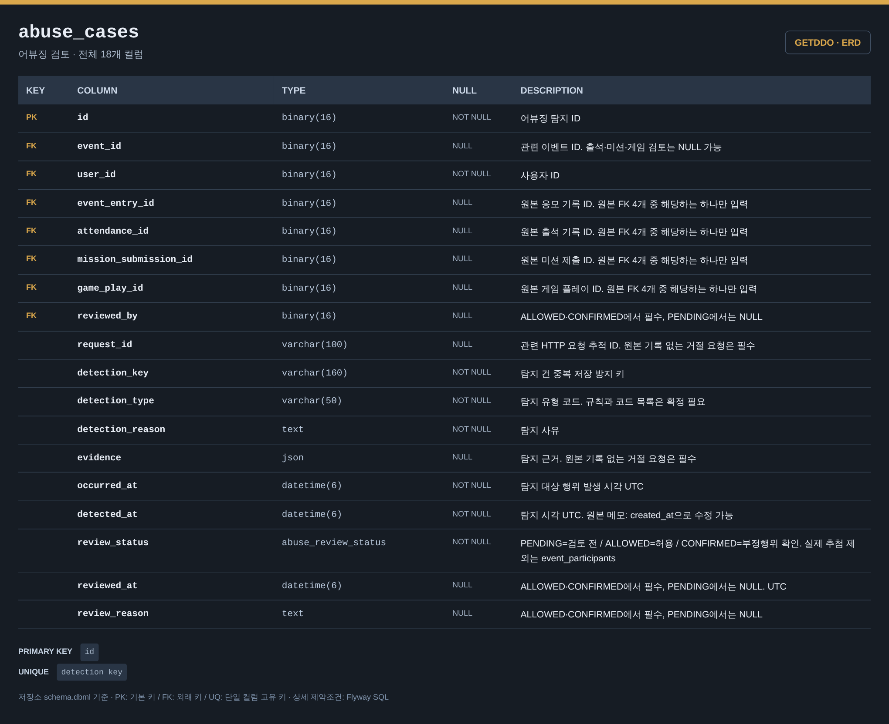

# 어뷰징 검토 ERD

[전체 ERD](../../../README.md#erd) · [도메인 목록](../README.md#도메인별-erd) · [ERDCloud](https://www.erdcloud.com/d/vuDvgmGQcvHf6f6g9)

의심 행위 탐지와 관리자 검토에 해당하는 테이블을 정리했습니다.

## 테이블

| 테이블 | 역할 |
| --- | --- |
| [`abuse_cases`](#abuse_cases) | 의심 행위 탐지 근거와 검토 결과 |

## 테이블 이미지

저장소 DBML의 전체 컬럼·자료형·키·설명을 캡처한 이미지입니다. 이미지를 누르면 원본 크기로 볼 수 있습니다.

### abuse_cases

## 다른 도메인과의 연결

FK가 있는 테이블에서 참조하는 테이블 방향으로 표시합니다. 테이블 이름을 누르면 해당 도메인으로 이동합니다.

| FK가 있는 테이블 | FK 컬럼 | 참조 테이블 | 참조 컬럼 |
| --- | --- | --- | --- |
| `abuse_cases` | `event_id` | [`events`](event.md#events) | `id` |
| `abuse_cases` | `user_id` | [`users`](user.md#users) | `id` |
| `abuse_cases` | `event_entry_id` | [`event_entries`](event.md#event_entries) | `id` |
| `abuse_cases` | `attendance_id` | [`attendances`](attendance.md#attendances) | `id` |
| `abuse_cases` | `mission_submission_id` | [`mission_submissions`](mission.md#mission_submissions) | `id` |
| `abuse_cases` | `game_play_id` | [`game_plays`](game.md#game_plays) | `id` |
| `abuse_cases` | `reviewed_by` | [`users`](user.md#users) | `id` |
| [`ticket_recovery_targets`](ticket.md#ticket_recovery_targets) | `abuse_case_id` | `abuse_cases` | `id` |

## 스키마 원본

- [Flyway SQL](../../../storage/db/src/main/resources/db/migration/abuse/V009__create_abuse_tables.sql): 실제 DB 적용 기준
- [통합 DBML](../schema.dbml): 전체 컬럼과 FK 관계

[← 응모권](ticket.md) · [추첨·발표 →](drawing.md)

[전체 ERD](../../../README.md#erd) · [도메인 목록](../README.md#도메인별-erd) · [ERDCloud](https://www.erdcloud.com/d/vuDvgmGQcvHf6f6g9)
