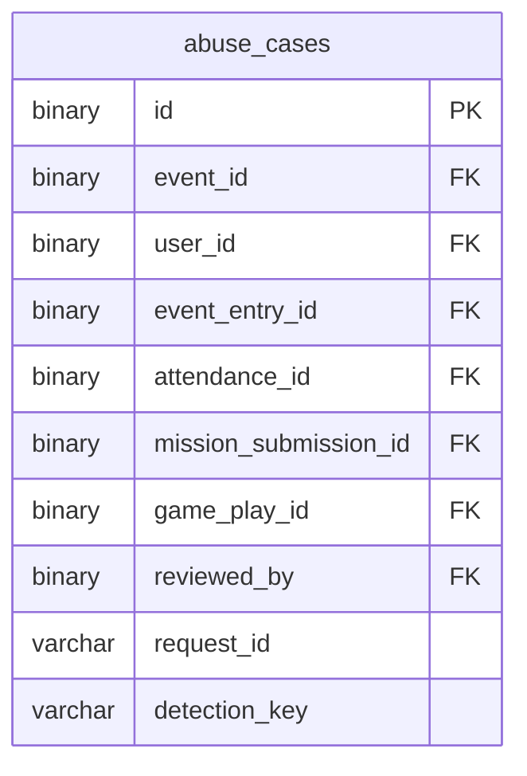

# 어뷰징 검토 ERD

[전체 ERD](../../../README.md#erd) · [도메인 목록](../README.md#도메인별-erd) · [ERDCloud](https://www.erdcloud.com/d/vuDvgmGQcvHf6f6g9)

의심 행위 탐지와 관리자 검토에 해당하는 테이블을 정리했습니다.

## 테이블

| 테이블 | 역할 |
| --- | --- |
| [`abuse_cases`](../../../storage/db/src/main/resources/db/migration/abuse/V009__create_abuse_tables.sql#L4) | 의심 행위 탐지 근거와 검토 결과 |

## 관계도

이 도메인의 PK·FK와 일부 주요 컬럼, 내부 FK 관계를 요약했습니다. 전체 컬럼·UNIQUE·CHECK는 아래 SQL을 확인합니다.

## 다른 도메인과의 연결

FK가 있는 테이블에서 참조하는 테이블 방향으로 표시합니다. 테이블 이름을 누르면 해당 도메인으로 이동합니다.

| FK가 있는 테이블 | FK 컬럼 | 참조 테이블 | 참조 컬럼 |
| --- | --- | --- | --- |
| `abuse_cases` | `event_id` | [`events`](event.md) | `id` |
| `abuse_cases` | `user_id` | [`users`](user.md) | `id` |
| `abuse_cases` | `event_entry_id` | [`event_entries`](event.md) | `id` |
| `abuse_cases` | `attendance_id` | [`attendances`](attendance.md) | `id` |
| `abuse_cases` | `mission_submission_id` | [`mission_submissions`](mission.md) | `id` |
| `abuse_cases` | `game_play_id` | [`game_plays`](game.md) | `id` |
| `abuse_cases` | `reviewed_by` | [`users`](user.md) | `id` |
| [`ticket_recovery_targets`](ticket.md) | `abuse_case_id` | `abuse_cases` | `id` |

## 스키마 원본

- [Flyway SQL](../../../storage/db/src/main/resources/db/migration/abuse/V009__create_abuse_tables.sql): 실제 DB 적용 기준
- [통합 DBML](../schema.dbml): 전체 컬럼과 FK 관계

[← 응모권](ticket.md) · [추첨·발표 →](drawing.md)

[전체 ERD](../../../README.md#erd) · [도메인 목록](../README.md#도메인별-erd) · [ERDCloud](https://www.erdcloud.com/d/vuDvgmGQcvHf6f6g9)
