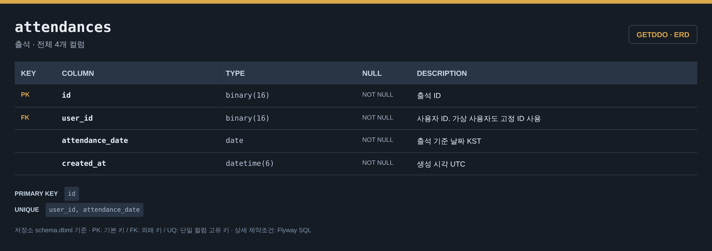
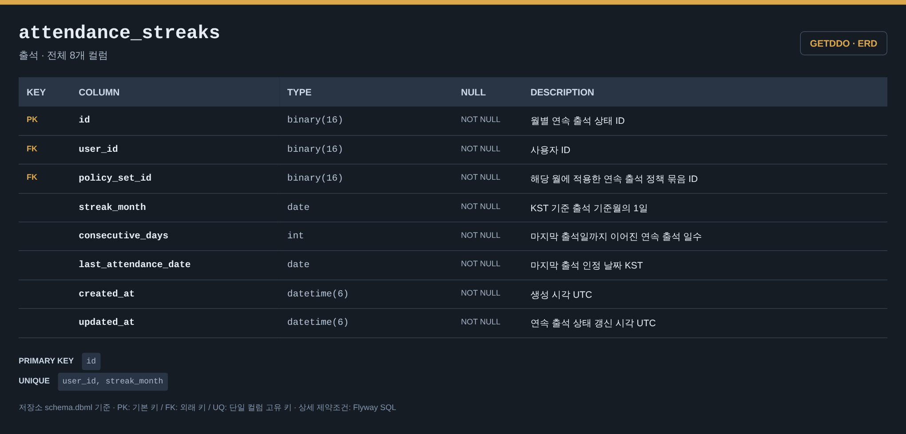
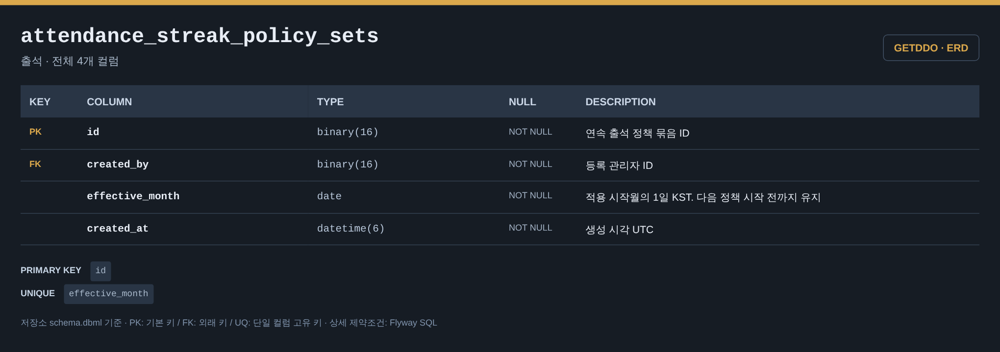
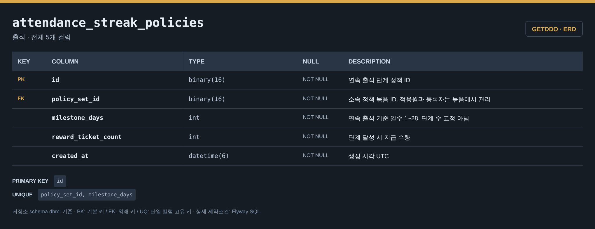
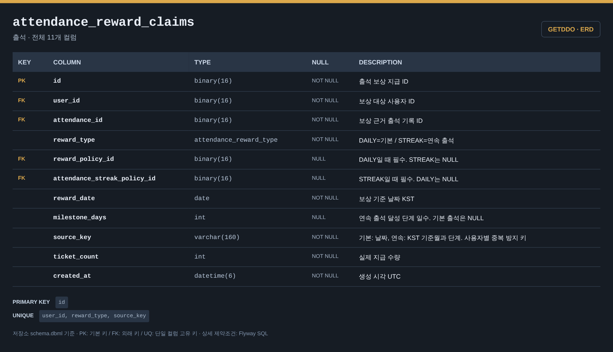

# 출석 ERD

[전체 ERD](../../../README.md#erd) · [도메인 목록](../README.md#도메인별-erd) · [ERDCloud](https://www.erdcloud.com/d/vuDvgmGQcvHf6f6g9)

일일·연속 출석과 보상 기록에 해당하는 테이블을 정리했습니다.

## 테이블

| 테이블 | 역할 |
| --- | --- |
| [`attendances`](#attendances) | 사용자별 일일 출석 기록 |
| [`attendance_streaks`](#attendance_streaks) | 사용자별 월간 연속 출석 상태 |
| [`attendance_streak_policy_sets`](#attendance_streak_policy_sets) | 적용월별 연속 출석 정책 묶음 |
| [`attendance_streak_policies`](#attendance_streak_policies) | 연속 출석 단계와 보상 수량 |
| [`attendance_reward_claims`](#attendance_reward_claims) | 출석 보상 지급 기록 |

## 테이블 이미지

저장소 DBML의 전체 컬럼·자료형·키·설명을 캡처한 이미지입니다. 이미지를 누르면 원본 크기로 볼 수 있습니다.

### attendances

### attendance_streaks

### attendance_streak_policy_sets

### attendance_streak_policies

### attendance_reward_claims

## 다른 도메인과의 연결

FK가 있는 테이블에서 참조하는 테이블 방향으로 표시합니다. 테이블 이름을 누르면 해당 도메인으로 이동합니다.

| FK가 있는 테이블 | FK 컬럼 | 참조 테이블 | 참조 컬럼 |
| --- | --- | --- | --- |
| `attendances` | `user_id` | [`users`](user.md#users) | `id` |
| [`abuse_cases`](abuse.md#abuse_cases) | `attendance_id` | `attendances` | `id` |
| [`ticket_ledger`](ticket.md#ticket_ledger) | `attendance_reward_claim_id` | `attendance_reward_claims` | `id` |
| `attendance_streaks` | `user_id` | [`users`](user.md#users) | `id` |
| `attendance_streak_policy_sets` | `created_by` | [`users`](user.md#users) | `id` |
| `attendance_reward_claims` | `user_id` | [`users`](user.md#users) | `id` |
| `attendance_reward_claims` | `reward_policy_id` | [`reward_policies`](reward.md#reward_policies) | `id` |

## 스키마 원본

- [Flyway SQL](../../../storage/db/src/main/resources/db/migration/attendance/V004__create_attendance_tables.sql): 실제 DB 적용 기준
- [통합 DBML](../schema.dbml): 전체 컬럼과 FK 관계

[← 이벤트·응모](event.md) · [미션 →](mission.md)

[전체 ERD](../../../README.md#erd) · [도메인 목록](../README.md#도메인별-erd) · [ERDCloud](https://www.erdcloud.com/d/vuDvgmGQcvHf6f6g9)
