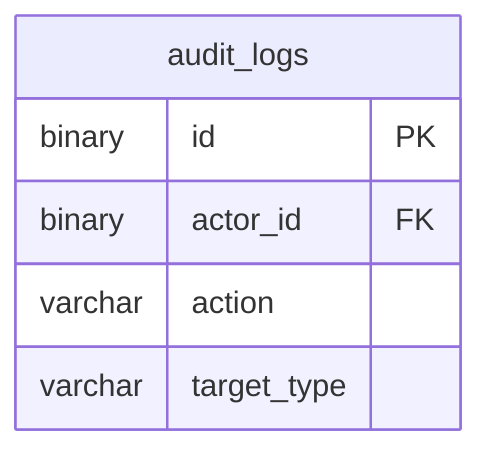

# 감사 로그 ERD

[전체 ERD](../../../README.md#erd) · [도메인 목록](../README.md#도메인별-erd) · [ERDCloud](https://www.erdcloud.com/d/vuDvgmGQcvHf6f6g9)

변경 행위와 변경 전후 데이터에 해당하는 테이블을 정리했습니다.

## 테이블

| 테이블 | 역할 |
| --- | --- |
| [`audit_logs`](../../../storage/db/src/main/resources/db/migration/audit/V011__create_audit_tables.sql#L4) | 행위자·대상·변경 전후 감사 기록 |

## 관계도

이 도메인의 PK·FK와 일부 주요 컬럼, 내부 FK 관계를 요약했습니다. 전체 컬럼·UNIQUE·CHECK는 아래 SQL을 확인합니다.

## 다른 도메인과의 연결

FK가 있는 테이블에서 참조하는 테이블 방향으로 표시합니다. 테이블 이름을 누르면 해당 도메인으로 이동합니다.

| FK가 있는 테이블 | FK 컬럼 | 참조 테이블 | 참조 컬럼 |
| --- | --- | --- | --- |
| `audit_logs` | `actor_id` | [`users`](user.md) | `id` |

## 스키마 원본

- [Flyway SQL](../../../storage/db/src/main/resources/db/migration/audit/V011__create_audit_tables.sql): 실제 DB 적용 기준
- [통합 DBML](../schema.dbml): 전체 컬럼과 FK 관계

[← 알림](notification.md)

[전체 ERD](../../../README.md#erd) · [도메인 목록](../README.md#도메인별-erd) · [ERDCloud](https://www.erdcloud.com/d/vuDvgmGQcvHf6f6g9)
