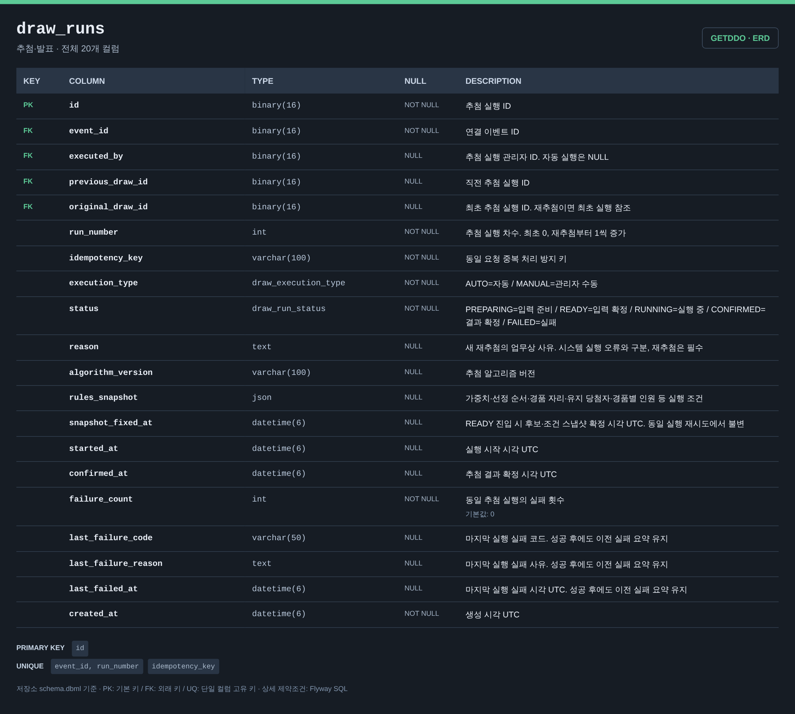
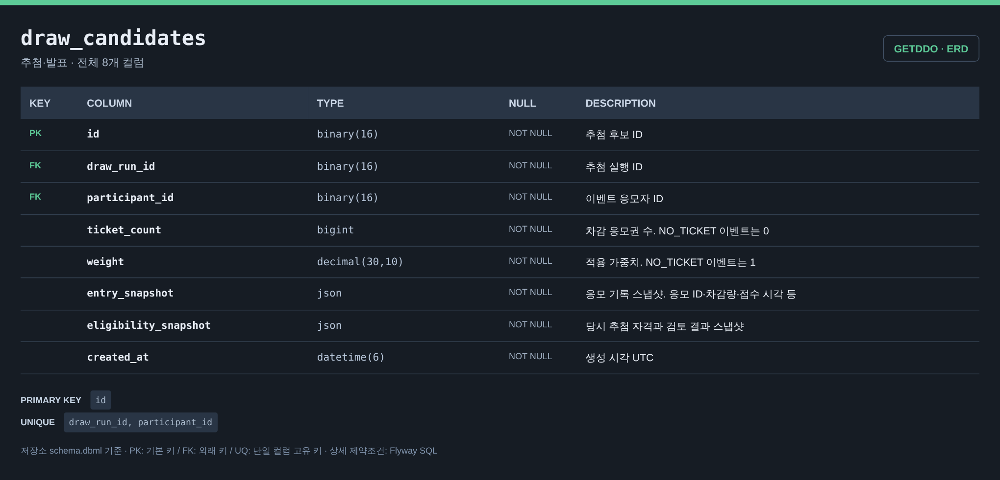
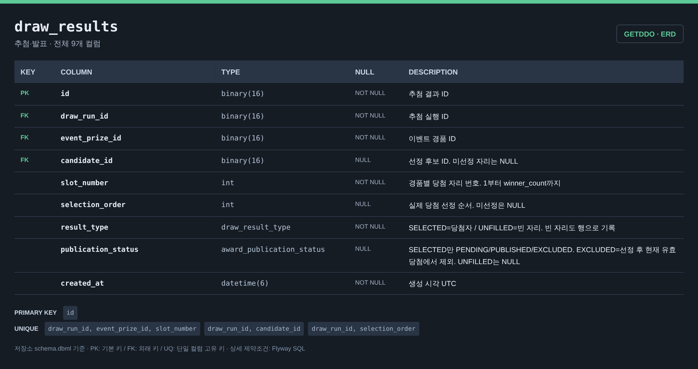
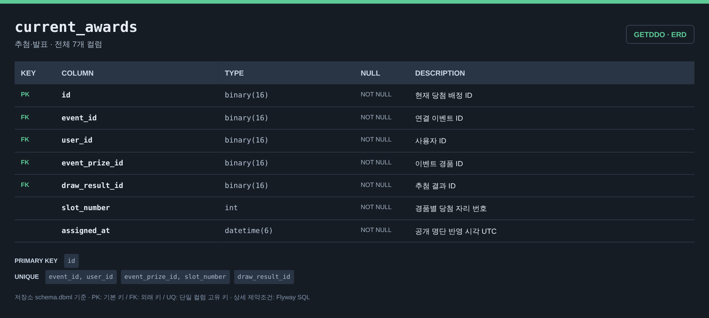
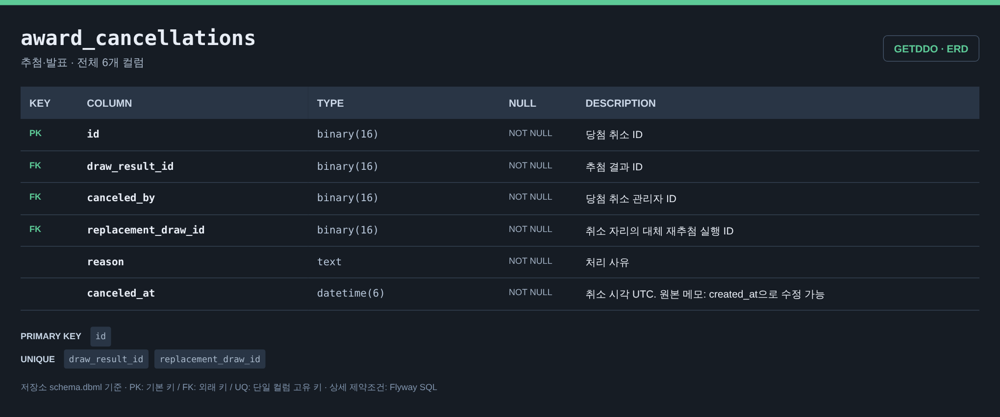
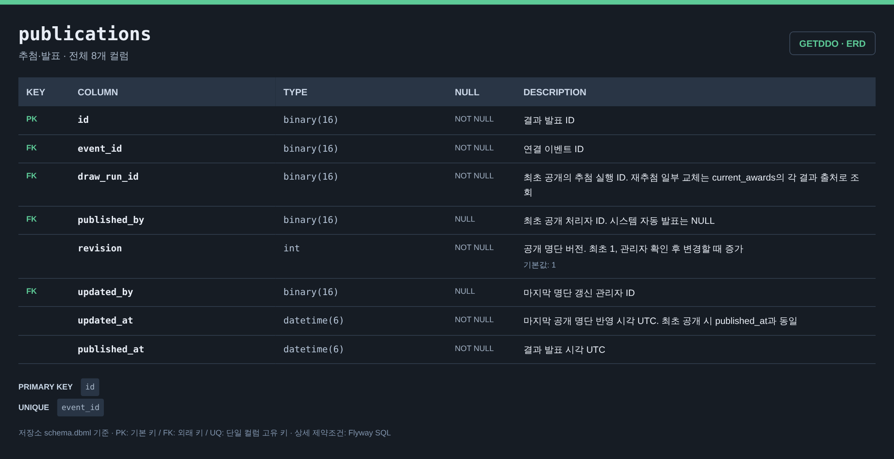

# 추첨·발표 ERD

[전체 ERD](../../../README.md#erd) · [도메인 목록](../README.md#도메인별-erd) · [ERDCloud](https://www.erdcloud.com/d/vuDvgmGQcvHf6f6g9)

추첨 실행·후보·결과·당첨·발표에 해당하는 테이블을 정리했습니다.

## 테이블

| 테이블 | 역할 |
| --- | --- |
| [`draw_runs`](#draw_runs) | 추첨 실행과 조건 스냅샷 |
| [`draw_candidates`](#draw_candidates) | 실행별 후보·가중치 스냅샷 |
| [`draw_results`](#draw_results) | 경품별 추첨 결과와 빈 자리 |
| [`current_awards`](#current_awards) | 현재 유효한 당첨 |
| [`award_cancellations`](#award_cancellations) | 당첨 취소와 대체 추첨 연결 |
| [`publications`](#publications) | 추첨 결과 발표 이력 |

## 테이블 이미지

저장소 DBML의 전체 컬럼·자료형·키·설명을 캡처한 이미지입니다. 이미지를 누르면 원본 크기로 볼 수 있습니다.

### draw_runs

### draw_candidates

### draw_results

### current_awards

### award_cancellations

### publications

## 다른 도메인과의 연결

FK가 있는 테이블에서 참조하는 테이블 방향으로 표시합니다. 테이블 이름을 누르면 해당 도메인으로 이동합니다.

| FK가 있는 테이블 | FK 컬럼 | 참조 테이블 | 참조 컬럼 |
| --- | --- | --- | --- |
| `draw_results` | `event_prize_id` | [`event_prizes`](event.md#event_prizes) | `id` |
| `current_awards` | `event_id` | [`events`](event.md#events) | `id` |
| `current_awards` | `user_id` | [`users`](user.md#users) | `id` |
| `current_awards` | `event_prize_id` | [`event_prizes`](event.md#event_prizes) | `id` |
| `draw_candidates` | `participant_id` | [`event_participants`](event.md#event_participants) | `id` |
| `award_cancellations` | `canceled_by` | [`users`](user.md#users) | `id` |
| [`notification_jobs`](notification.md#notification_jobs) | `publication_id` | `publications` | `id` |
| `publications` | `event_id` | [`events`](event.md#events) | `id` |
| `publications` | `published_by` | [`users`](user.md#users) | `id` |
| `publications` | `updated_by` | [`users`](user.md#users) | `id` |
| `draw_runs` | `event_id` | [`events`](event.md#events) | `id` |
| `draw_runs` | `executed_by` | [`users`](user.md#users) | `id` |

## 스키마 원본

- [Flyway SQL](../../../storage/db/src/main/resources/db/migration/drawing/V007__create_drawing_tables.sql): 실제 DB 적용 기준
- [통합 DBML](../schema.dbml): 전체 컬럼과 FK 관계

[← 어뷰징 검토](abuse.md) · [알림 →](notification.md)

[전체 ERD](../../../README.md#erd) · [도메인 목록](../README.md#도메인별-erd) · [ERDCloud](https://www.erdcloud.com/d/vuDvgmGQcvHf6f6g9)
