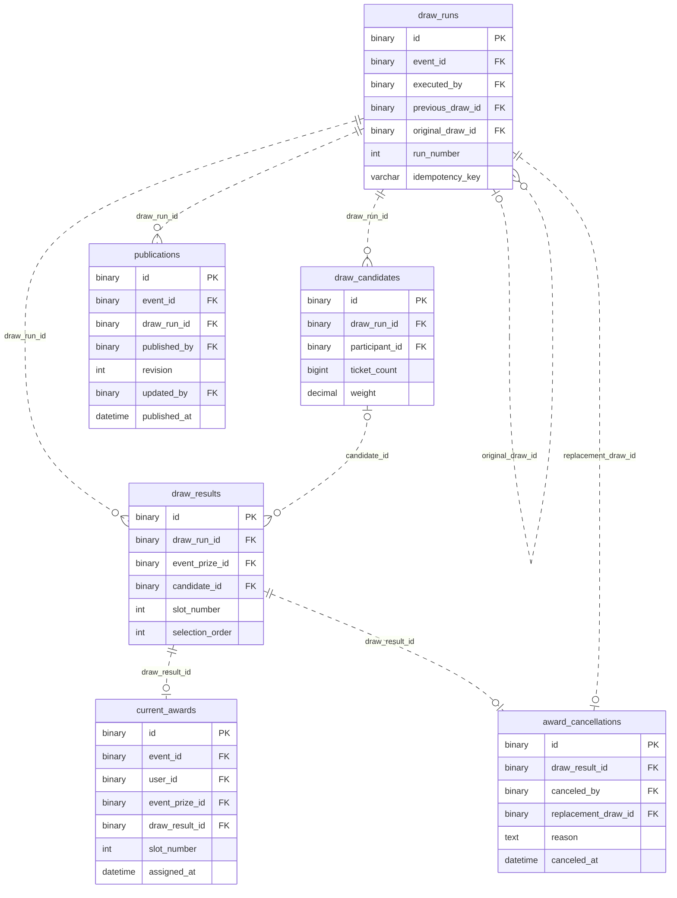

# 추첨·발표 ERD

[전체 ERD](../../../README.md#erd) · [도메인 목록](../README.md#도메인별-erd) · [ERDCloud](https://www.erdcloud.com/d/vuDvgmGQcvHf6f6g9)

추첨 실행·후보·결과·당첨·발표에 해당하는 테이블을 정리했습니다.

## 테이블

| 테이블 | 역할 |
| --- | --- |
| [`draw_runs`](../../../storage/db/src/main/resources/db/migration/drawing/V007__create_drawing_tables.sql#L4) | 추첨 실행과 조건 스냅샷 |
| [`draw_candidates`](../../../storage/db/src/main/resources/db/migration/drawing/V007__create_drawing_tables.sql#L34) | 실행별 후보·가중치 스냅샷 |
| [`draw_results`](../../../storage/db/src/main/resources/db/migration/drawing/V007__create_drawing_tables.sql#L49) | 경품별 추첨 결과와 빈 자리 |
| [`current_awards`](../../../storage/db/src/main/resources/db/migration/drawing/V007__create_drawing_tables.sql#L69) | 현재 유효한 당첨 |
| [`award_cancellations`](../../../storage/db/src/main/resources/db/migration/drawing/V007__create_drawing_tables.sql#L87) | 당첨 취소와 대체 추첨 연결 |
| [`publications`](../../../storage/db/src/main/resources/db/migration/drawing/V007__create_drawing_tables.sql#L102) | 추첨 결과 발표 이력 |

## 관계도

이 도메인의 PK·FK와 일부 주요 컬럼, 내부 FK 관계를 요약했습니다. 전체 컬럼·UNIQUE·CHECK는 아래 SQL을 확인합니다.

## 다른 도메인과의 연결

FK가 있는 테이블에서 참조하는 테이블 방향으로 표시합니다. 테이블 이름을 누르면 해당 도메인으로 이동합니다.

| FK가 있는 테이블 | FK 컬럼 | 참조 테이블 | 참조 컬럼 |
| --- | --- | --- | --- |
| `draw_results` | `event_prize_id` | [`event_prizes`](event.md) | `id` |
| `current_awards` | `event_id` | [`events`](event.md) | `id` |
| `current_awards` | `user_id` | [`users`](user.md) | `id` |
| `current_awards` | `event_prize_id` | [`event_prizes`](event.md) | `id` |
| `draw_candidates` | `participant_id` | [`event_participants`](event.md) | `id` |
| `award_cancellations` | `canceled_by` | [`users`](user.md) | `id` |
| [`notification_jobs`](notification.md) | `publication_id` | `publications` | `id` |
| `publications` | `event_id` | [`events`](event.md) | `id` |
| `publications` | `published_by` | [`users`](user.md) | `id` |
| `publications` | `updated_by` | [`users`](user.md) | `id` |
| `draw_runs` | `event_id` | [`events`](event.md) | `id` |
| `draw_runs` | `executed_by` | [`users`](user.md) | `id` |

## 스키마 원본

- [Flyway SQL](../../../storage/db/src/main/resources/db/migration/drawing/V007__create_drawing_tables.sql): 실제 DB 적용 기준
- [통합 DBML](../schema.dbml): 전체 컬럼과 FK 관계

[← 어뷰징 검토](abuse.md) · [알림 →](notification.md)

[전체 ERD](../../../README.md#erd) · [도메인 목록](../README.md#도메인별-erd) · [ERDCloud](https://www.erdcloud.com/d/vuDvgmGQcvHf6f6g9)
