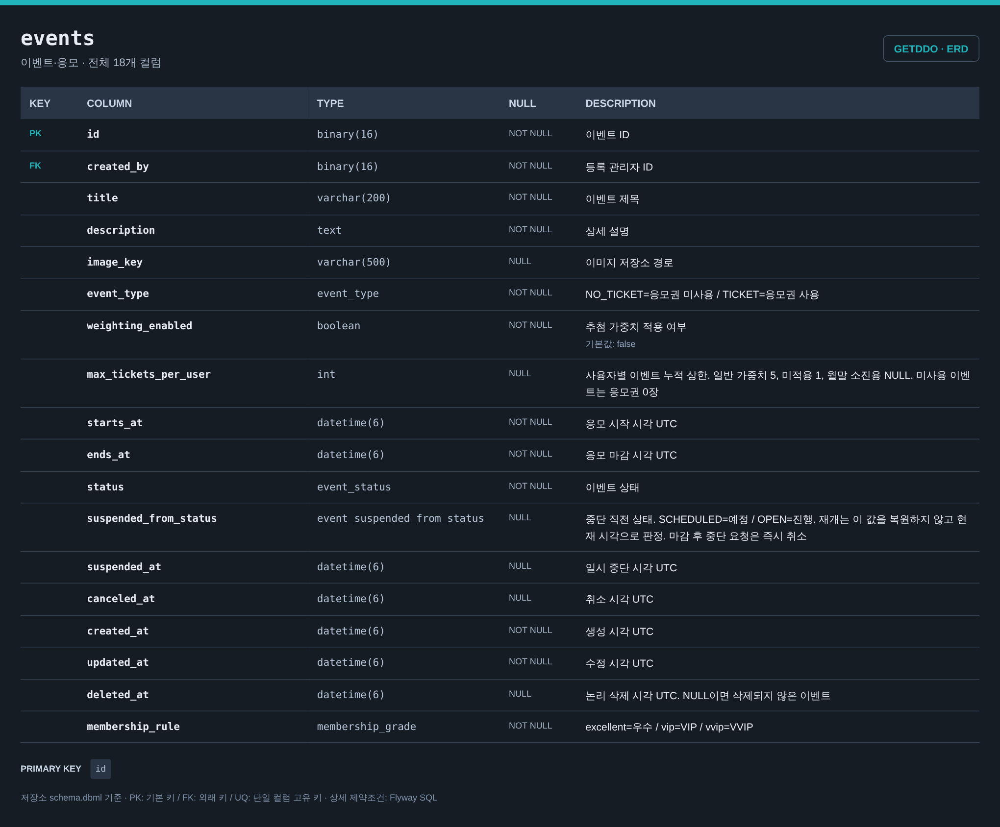
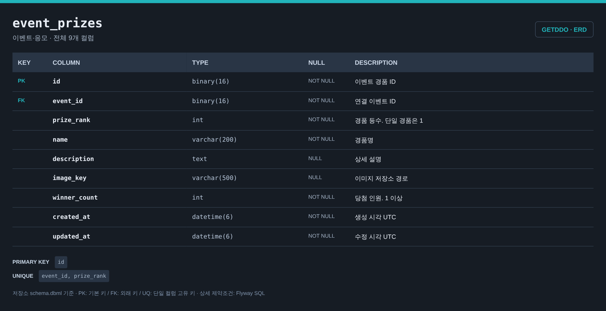
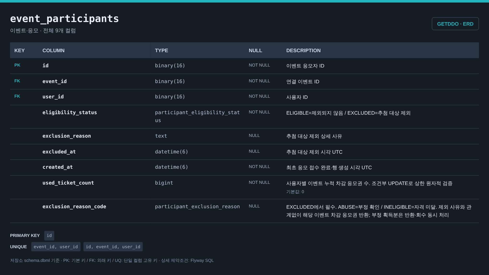
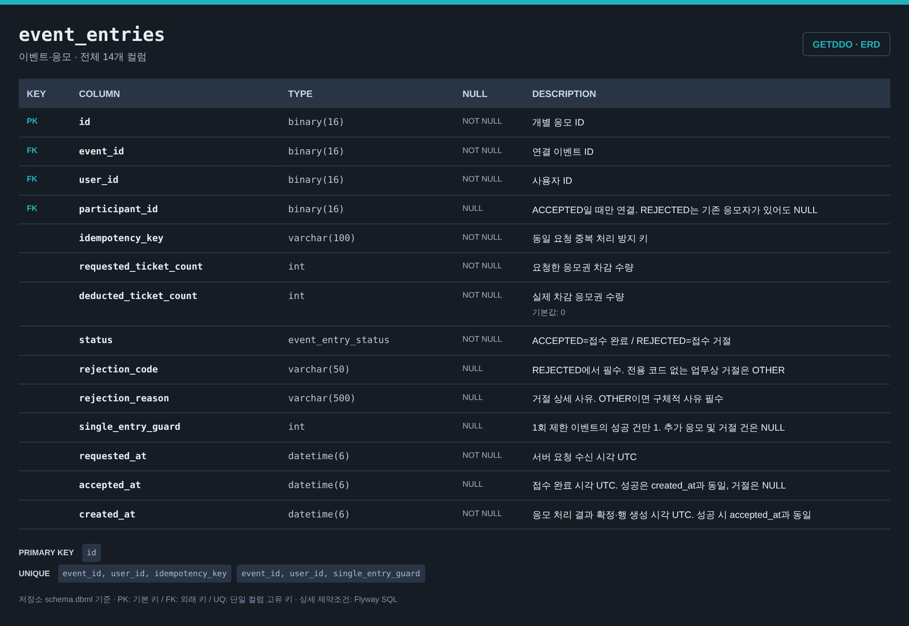
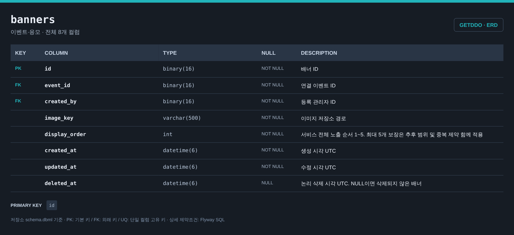

# 이벤트·응모 ERD

[전체 ERD](../../../README.md#erd) · [도메인 목록](../README.md#도메인별-erd) · [ERDCloud](https://www.erdcloud.com/d/vuDvgmGQcvHf6f6g9)

이벤트·경품·응모자·응모 요청·배너에 해당하는 테이블을 정리했습니다.

## 테이블

| 테이블 | 역할 |
| --- | --- |
| [`events`](#events) | 이벤트 기본 정보와 응모 조건 |
| [`event_prizes`](#event_prizes) | 이벤트별 경품·등수·당첨 인원 |
| [`event_participants`](#event_participants) | 이벤트별 응모자와 자격 상태 |
| [`event_entries`](#event_entries) | 개별 응모 요청과 처리 결과 |
| [`banners`](#banners) | 이벤트 배너와 노출 순서 |

## 테이블 이미지

저장소 DBML의 전체 컬럼·자료형·키·설명을 캡처한 이미지입니다. 이미지를 누르면 원본 크기로 볼 수 있습니다.

### events

### event_prizes

### event_participants

### event_entries

### banners

## 다른 도메인과의 연결

FK가 있는 테이블에서 참조하는 테이블 방향으로 표시합니다. 테이블 이름을 누르면 해당 도메인으로 이동합니다.

| FK가 있는 테이블 | FK 컬럼 | 참조 테이블 | 참조 컬럼 |
| --- | --- | --- | --- |
| `event_participants` | `user_id` | [`users`](user.md#users) | `id` |
| [`draw_results`](drawing.md#draw_results) | `event_prize_id` | `event_prizes` | `id` |
| [`current_awards`](drawing.md#current_awards) | `event_id` | `events` | `id` |
| [`current_awards`](drawing.md#current_awards) | `event_prize_id` | `event_prizes` | `id` |
| [`draw_candidates`](drawing.md#draw_candidates) | `participant_id` | `event_participants` | `id` |
| `banners` | `created_by` | [`users`](user.md#users) | `id` |
| `events` | `created_by` | [`users`](user.md#users) | `id` |
| [`notification_jobs`](notification.md#notification_jobs) | `event_id` | `events` | `id` |
| [`notifications`](notification.md#notifications) | `event_id` | `events` | `id` |
| `event_entries` | `user_id` | [`users`](user.md#users) | `id` |
| [`publications`](drawing.md#publications) | `event_id` | `events` | `id` |
| [`draw_runs`](drawing.md#draw_runs) | `event_id` | `events` | `id` |
| [`abuse_cases`](abuse.md#abuse_cases) | `event_id` | `events` | `id` |
| [`abuse_cases`](abuse.md#abuse_cases) | `event_entry_id` | `event_entries` | `id` |
| [`ticket_ledger`](ticket.md#ticket_ledger) | `event_entry_id` | `event_entries` | `id` |

## 스키마 원본

- [Flyway SQL](../../../storage/db/src/main/resources/db/migration/event/V006__create_event_tables.sql): 실제 DB 적용 기준
- [통합 DBML](../schema.dbml): 전체 컬럼과 FK 관계

[← 사용자](user.md) · [출석 →](attendance.md)

[전체 ERD](../../../README.md#erd) · [도메인 목록](../README.md#도메인별-erd) · [ERDCloud](https://www.erdcloud.com/d/vuDvgmGQcvHf6f6g9)
