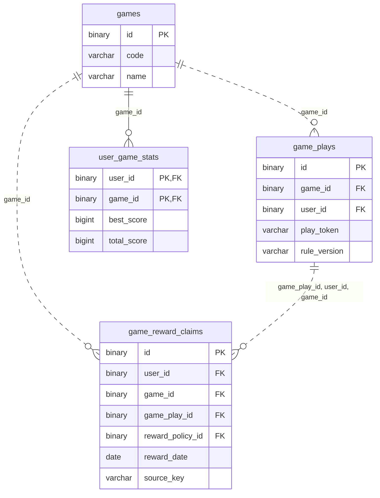

# 게임 ERD

[전체 ERD](../../../README.md#erd) · [도메인 목록](../README.md#도메인별-erd) · [ERDCloud](https://www.erdcloud.com/d/vuDvgmGQcvHf6f6g9)

게임·플레이·통계·보상 기록에 해당하는 테이블을 정리했습니다.

## 테이블

| 테이블 | 역할 |
| --- | --- |
| [`games`](../../../storage/db/src/main/resources/db/migration/game/V005__create_game_tables.sql#L4) | 게임 정보와 규칙 |
| [`game_plays`](../../../storage/db/src/main/resources/db/migration/game/V005__create_game_tables.sql#L18) | 플레이 기록과 결과 검증 |
| [`user_game_stats`](../../../storage/db/src/main/resources/db/migration/game/V005__create_game_tables.sql#L37) | 사용자별 게임 통계 |
| [`game_reward_claims`](../../../storage/db/src/main/resources/db/migration/game/V005__create_game_tables.sql#L51) | 게임 보상 지급 기록 |

## 관계도

이 도메인의 PK·FK와 일부 주요 컬럼, 내부 FK 관계를 요약했습니다. 전체 컬럼·UNIQUE·CHECK는 아래 SQL을 확인합니다.

## 다른 도메인과의 연결

FK가 있는 테이블에서 참조하는 테이블 방향으로 표시합니다. 테이블 이름을 누르면 해당 도메인으로 이동합니다.

| FK가 있는 테이블 | FK 컬럼 | 참조 테이블 | 참조 컬럼 |
| --- | --- | --- | --- |
| `user_game_stats` | `user_id` | [`users`](user.md) | `id` |
| `game_plays` | `user_id` | [`users`](user.md) | `id` |
| [`reward_policies`](reward.md) | `game_id` | `games` | `id` |
| [`abuse_cases`](abuse.md) | `game_play_id` | `game_plays` | `id` |
| [`ticket_ledger`](ticket.md) | `game_reward_claim_id` | `game_reward_claims` | `id` |
| `game_reward_claims` | `user_id` | [`users`](user.md) | `id` |
| `game_reward_claims` | `reward_policy_id` | [`reward_policies`](reward.md) | `id` |

## 스키마 원본

- [Flyway SQL](../../../storage/db/src/main/resources/db/migration/game/V005__create_game_tables.sql): 실제 DB 적용 기준
- [통합 DBML](../schema.dbml): 전체 컬럼과 FK 관계

[← 미션](mission.md) · [보상 정책 →](reward.md)

[전체 ERD](../../../README.md#erd) · [도메인 목록](../README.md#도메인별-erd) · [ERDCloud](https://www.erdcloud.com/d/vuDvgmGQcvHf6f6g9)
