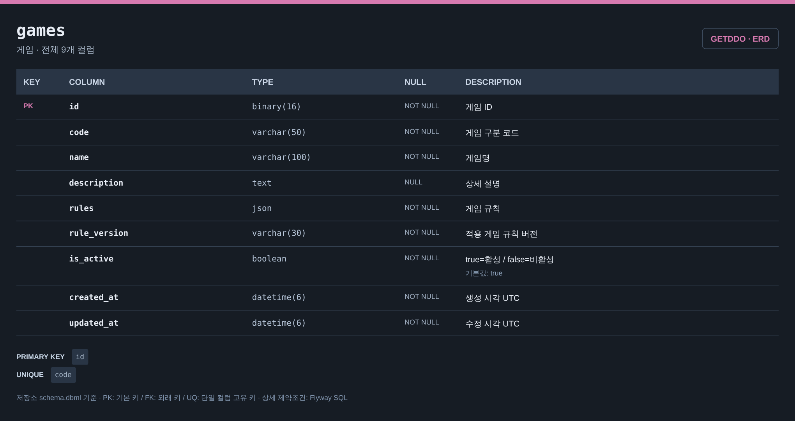
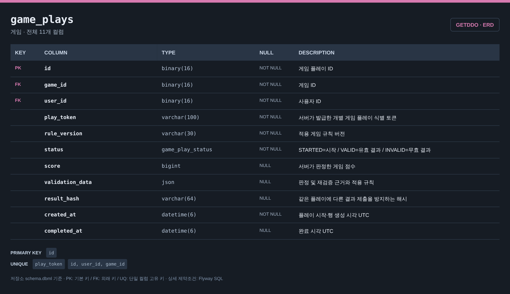
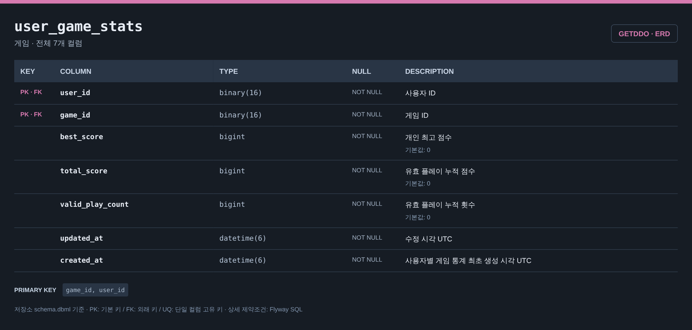
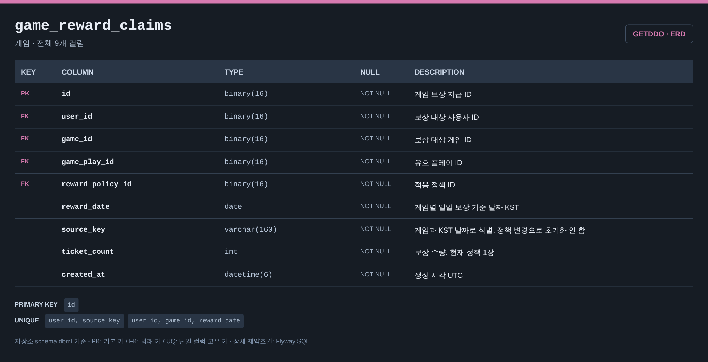

# 게임 ERD

[전체 ERD](../../../README.md#erd) · [도메인 목록](../README.md#도메인별-erd) · [ERDCloud](https://www.erdcloud.com/d/vuDvgmGQcvHf6f6g9)

게임·플레이·통계·보상 기록에 해당하는 테이블을 정리했습니다.

## 테이블

| 테이블 | 역할 |
| --- | --- |
| [`games`](#games) | 게임 정보와 규칙 |
| [`game_plays`](#game_plays) | 플레이 기록과 결과 검증 |
| [`user_game_stats`](#user_game_stats) | 사용자별 게임 통계 |
| [`game_reward_claims`](#game_reward_claims) | 게임 보상 지급 기록 |

## 테이블 이미지

저장소 DBML의 전체 컬럼·자료형·키·설명을 캡처한 이미지입니다. 이미지를 누르면 원본 크기로 볼 수 있습니다.

### games

### game_plays

### user_game_stats

### game_reward_claims

## 다른 도메인과의 연결

FK가 있는 테이블에서 참조하는 테이블 방향으로 표시합니다. 테이블 이름을 누르면 해당 도메인으로 이동합니다.

| FK가 있는 테이블 | FK 컬럼 | 참조 테이블 | 참조 컬럼 |
| --- | --- | --- | --- |
| `user_game_stats` | `user_id` | [`users`](user.md#users) | `id` |
| `game_plays` | `user_id` | [`users`](user.md#users) | `id` |
| [`reward_policies`](reward.md#reward_policies) | `game_id` | `games` | `id` |
| [`abuse_cases`](abuse.md#abuse_cases) | `game_play_id` | `game_plays` | `id` |
| [`ticket_ledger`](ticket.md#ticket_ledger) | `game_reward_claim_id` | `game_reward_claims` | `id` |
| `game_reward_claims` | `user_id` | [`users`](user.md#users) | `id` |
| `game_reward_claims` | `reward_policy_id` | [`reward_policies`](reward.md#reward_policies) | `id` |

## 스키마 원본

- [Flyway SQL](../../../storage/db/src/main/resources/db/migration/game/V005__create_game_tables.sql): 실제 DB 적용 기준
- [통합 DBML](../schema.dbml): 전체 컬럼과 FK 관계

[← 미션](mission.md) · [보상 정책 →](reward.md)

[전체 ERD](../../../README.md#erd) · [도메인 목록](../README.md#도메인별-erd) · [ERDCloud](https://www.erdcloud.com/d/vuDvgmGQcvHf6f6g9)
