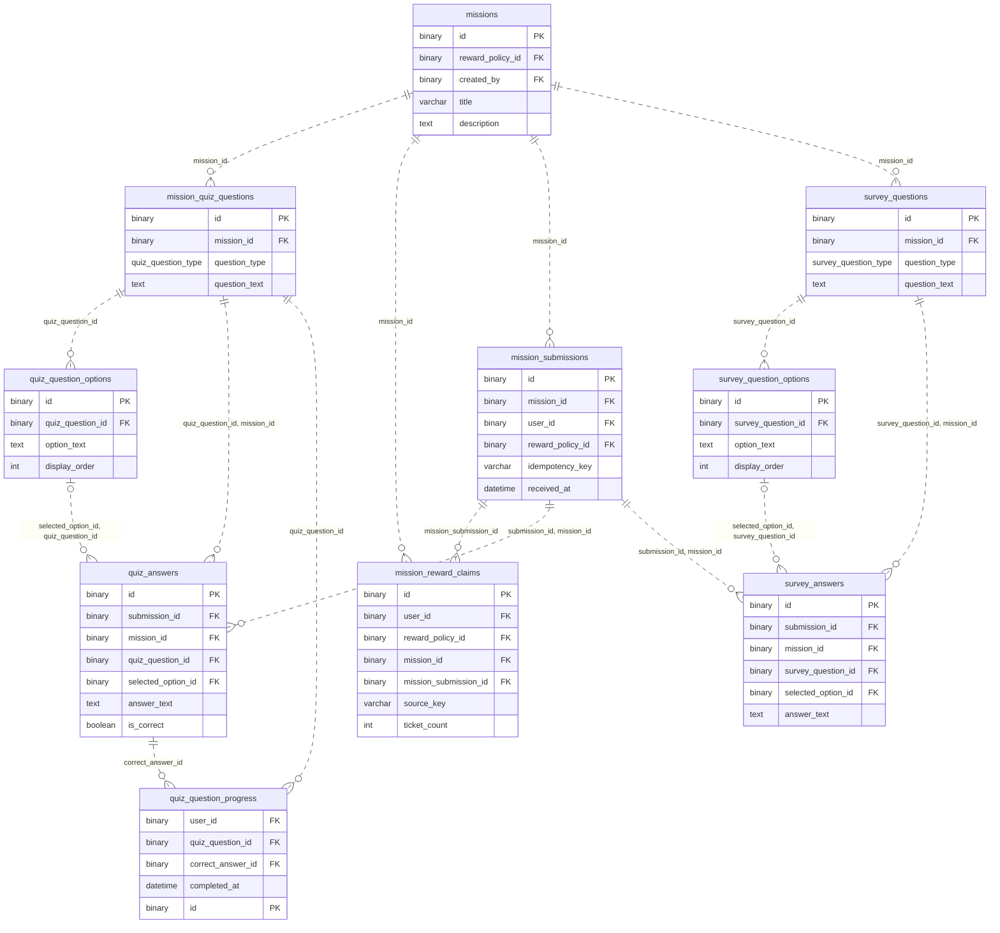

# 미션 ERD

[전체 ERD](../../../README.md#erd) · [도메인 목록](../README.md#도메인별-erd) · [ERDCloud](https://www.erdcloud.com/d/vuDvgmGQcvHf6f6g9)

퀴즈·설문·제출·보상 기록에 해당하는 테이블을 정리했습니다.

## 테이블

| 테이블 | 역할 |
| --- | --- |
| [`missions`](../../../storage/db/src/main/resources/db/migration/mission/V003__create_mission_tables.sql#L4) | 퀴즈·설문 미션과 운영 기간 |
| [`mission_submissions`](../../../storage/db/src/main/resources/db/migration/mission/V003__create_mission_tables.sql#L23) | 미션 제출과 완료 판정 |
| [`mission_reward_claims`](../../../storage/db/src/main/resources/db/migration/mission/V003__create_mission_tables.sql#L40) | 미션 보상 지급 기록 |
| [`mission_quiz_questions`](../../../storage/db/src/main/resources/db/migration/mission/V003__create_mission_tables.sql#L58) | 퀴즈 문항과 정답 |
| [`quiz_question_options`](../../../storage/db/src/main/resources/db/migration/mission/V003__create_mission_tables.sql#L76) | 퀴즈 선택지 |
| [`quiz_answers`](../../../storage/db/src/main/resources/db/migration/mission/V003__create_mission_tables.sql#L89) | 제출별 퀴즈 답변과 채점 결과 |
| [`quiz_question_progress`](../../../storage/db/src/main/resources/db/migration/mission/V003__create_mission_tables.sql#L109) | 사용자별 퀴즈 문항 완료 상태 |
| [`survey_questions`](../../../storage/db/src/main/resources/db/migration/mission/V003__create_mission_tables.sql#L123) | 설문 문항 |
| [`survey_question_options`](../../../storage/db/src/main/resources/db/migration/mission/V003__create_mission_tables.sql#L138) | 설문 선택지 |
| [`survey_answers`](../../../storage/db/src/main/resources/db/migration/mission/V003__create_mission_tables.sql#L150) | 제출별 설문 답변 |

## 관계도

이 도메인의 PK·FK와 일부 주요 컬럼, 내부 FK 관계를 요약했습니다. 전체 컬럼·UNIQUE·CHECK는 아래 SQL을 확인합니다.

## 다른 도메인과의 연결

FK가 있는 테이블에서 참조하는 테이블 방향으로 표시합니다. 테이블 이름을 누르면 해당 도메인으로 이동합니다.

| FK가 있는 테이블 | FK 컬럼 | 참조 테이블 | 참조 컬럼 |
| --- | --- | --- | --- |
| `mission_reward_claims` | `user_id` | [`users`](user.md) | `id` |
| `mission_reward_claims` | `reward_policy_id` | [`reward_policies`](reward.md) | `id` |
| `missions` | `reward_policy_id` | [`reward_policies`](reward.md) | `id` |
| `missions` | `created_by` | [`users`](user.md) | `id` |
| `mission_submissions` | `user_id` | [`users`](user.md) | `id` |
| `mission_submissions` | `reward_policy_id` | [`reward_policies`](reward.md) | `id` |
| [`abuse_cases`](abuse.md) | `mission_submission_id` | `mission_submissions` | `id` |
| [`ticket_ledger`](ticket.md) | `mission_reward_claim_id` | `mission_reward_claims` | `id` |
| `quiz_question_progress` | `user_id` | [`users`](user.md) | `id` |

## 스키마 원본

- [Flyway SQL](../../../storage/db/src/main/resources/db/migration/mission/V003__create_mission_tables.sql): 실제 DB 적용 기준
- [통합 DBML](../schema.dbml): 전체 컬럼과 FK 관계

[← 출석](attendance.md) · [게임 →](game.md)

[전체 ERD](../../../README.md#erd) · [도메인 목록](../README.md#도메인별-erd) · [ERDCloud](https://www.erdcloud.com/d/vuDvgmGQcvHf6f6g9)
