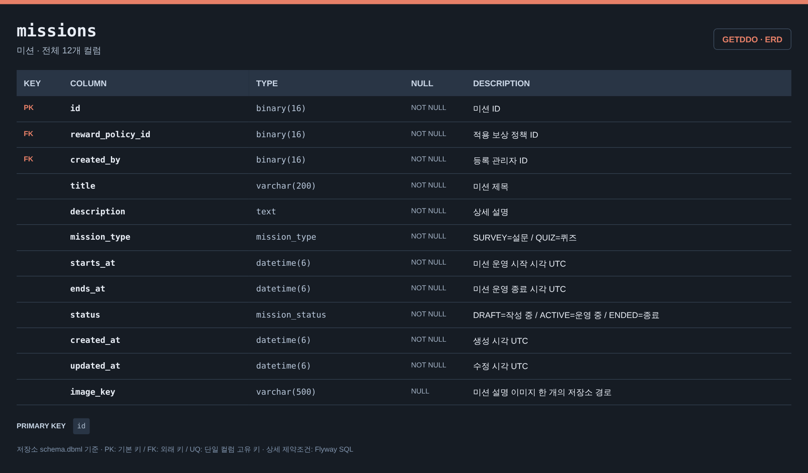
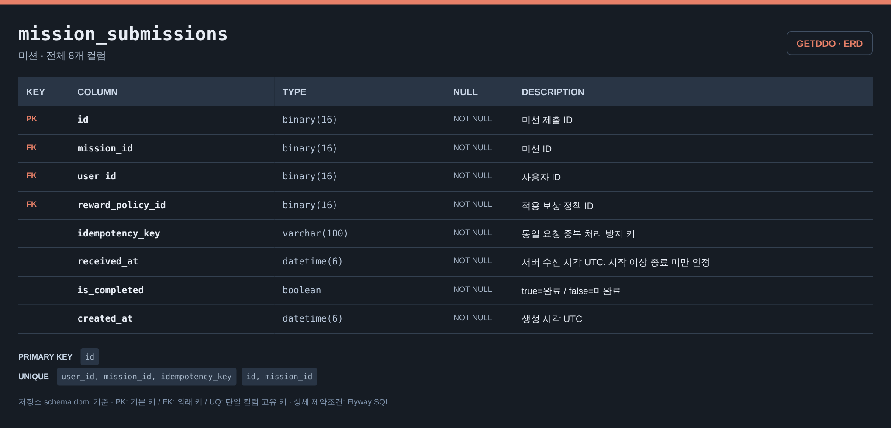
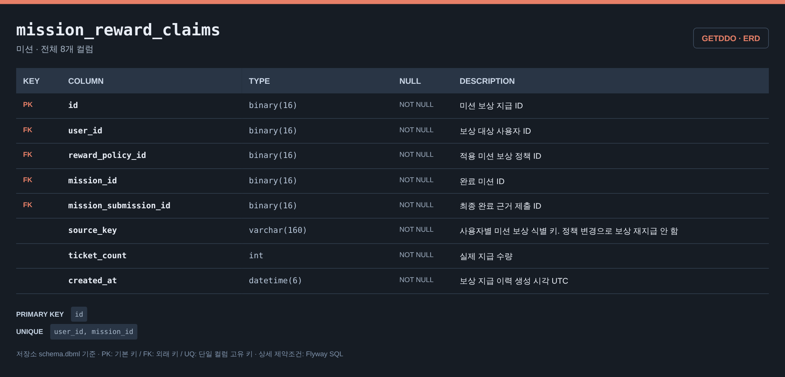
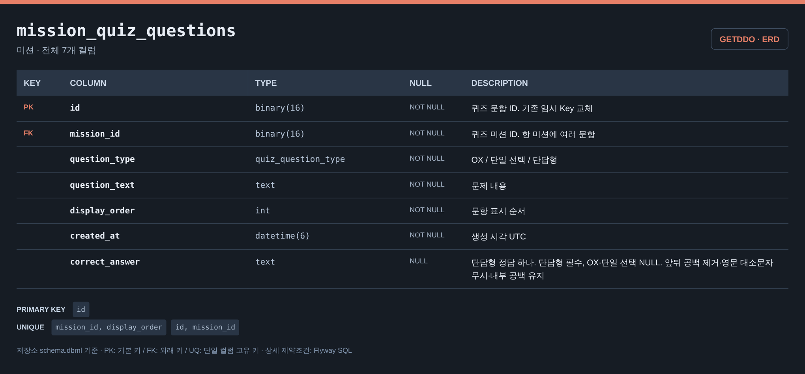
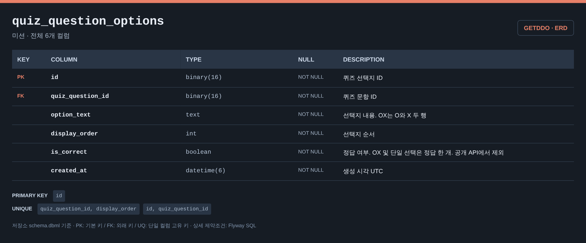
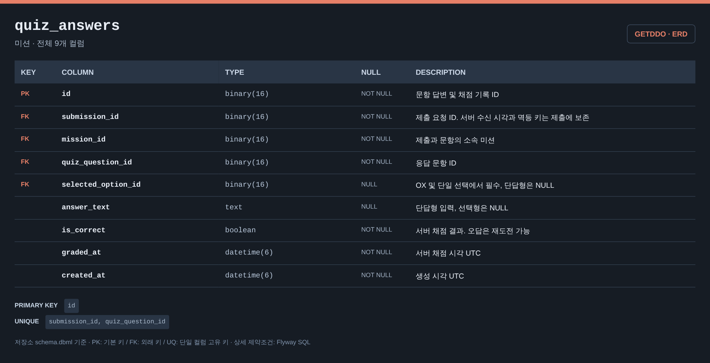
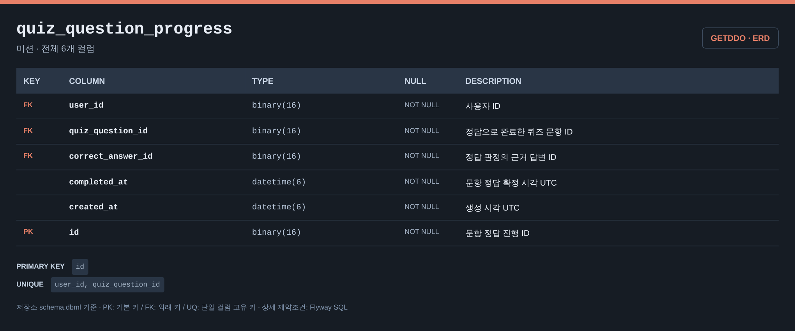
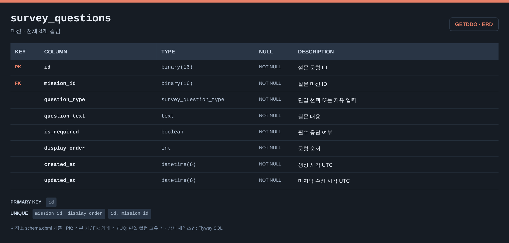
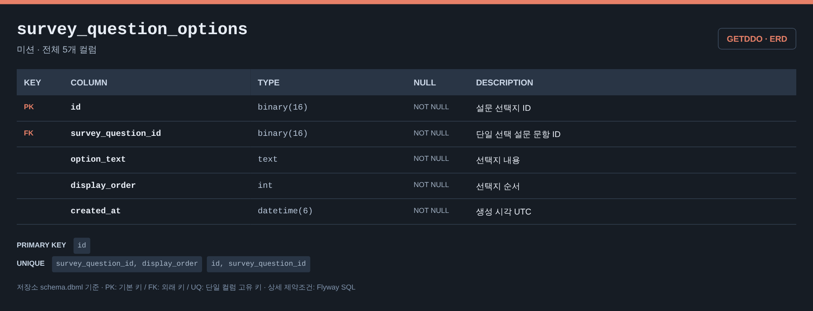
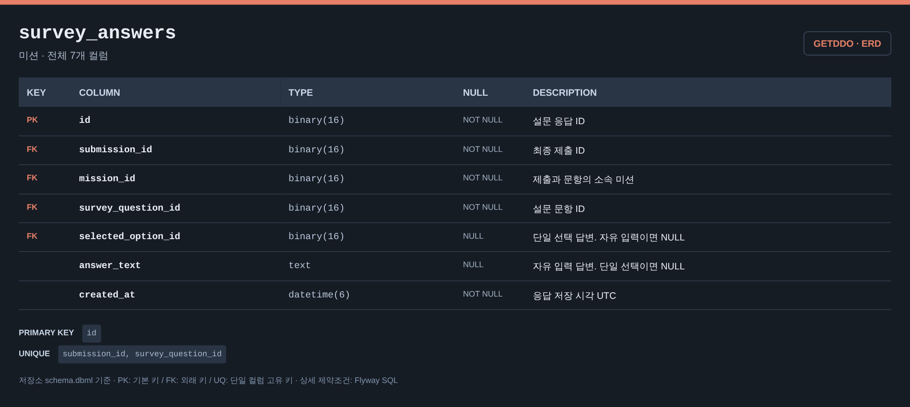

# 미션 ERD

[전체 ERD](../../../README.md#erd) · [도메인 목록](../README.md#도메인별-erd) · [ERDCloud](https://www.erdcloud.com/d/vuDvgmGQcvHf6f6g9)

퀴즈·설문·제출·보상 기록에 해당하는 테이블을 정리했습니다.

## 테이블

| 테이블 | 역할 |
| --- | --- |
| [`missions`](#missions) | 퀴즈·설문 미션과 운영 기간 |
| [`mission_submissions`](#mission_submissions) | 미션 제출과 완료 판정 |
| [`mission_reward_claims`](#mission_reward_claims) | 미션 보상 지급 기록 |
| [`mission_quiz_questions`](#mission_quiz_questions) | 퀴즈 문항과 정답 |
| [`quiz_question_options`](#quiz_question_options) | 퀴즈 선택지 |
| [`quiz_answers`](#quiz_answers) | 제출별 퀴즈 답변과 채점 결과 |
| [`quiz_question_progress`](#quiz_question_progress) | 사용자별 퀴즈 문항 완료 상태 |
| [`survey_questions`](#survey_questions) | 설문 문항 |
| [`survey_question_options`](#survey_question_options) | 설문 선택지 |
| [`survey_answers`](#survey_answers) | 제출별 설문 답변 |

## 테이블 이미지

저장소 DBML의 전체 컬럼·자료형·키·설명을 캡처한 이미지입니다. 이미지를 누르면 원본 크기로 볼 수 있습니다.

### missions

### mission_submissions

### mission_reward_claims

### mission_quiz_questions

### quiz_question_options

### quiz_answers

### quiz_question_progress

### survey_questions

### survey_question_options

### survey_answers

## 다른 도메인과의 연결

FK가 있는 테이블에서 참조하는 테이블 방향으로 표시합니다. 테이블 이름을 누르면 해당 도메인으로 이동합니다.

| FK가 있는 테이블 | FK 컬럼 | 참조 테이블 | 참조 컬럼 |
| --- | --- | --- | --- |
| `mission_reward_claims` | `user_id` | [`users`](user.md#users) | `id` |
| `mission_reward_claims` | `reward_policy_id` | [`reward_policies`](reward.md#reward_policies) | `id` |
| `missions` | `reward_policy_id` | [`reward_policies`](reward.md#reward_policies) | `id` |
| `missions` | `created_by` | [`users`](user.md#users) | `id` |
| `mission_submissions` | `user_id` | [`users`](user.md#users) | `id` |
| `mission_submissions` | `reward_policy_id` | [`reward_policies`](reward.md#reward_policies) | `id` |
| [`abuse_cases`](abuse.md#abuse_cases) | `mission_submission_id` | `mission_submissions` | `id` |
| [`ticket_ledger`](ticket.md#ticket_ledger) | `mission_reward_claim_id` | `mission_reward_claims` | `id` |
| `quiz_question_progress` | `user_id` | [`users`](user.md#users) | `id` |

## 스키마 원본

- [Flyway SQL](../../../storage/db/src/main/resources/db/migration/mission/V003__create_mission_tables.sql): 실제 DB 적용 기준
- [통합 DBML](../schema.dbml): 전체 컬럼과 FK 관계

[← 출석](attendance.md) · [게임 →](game.md)

[전체 ERD](../../../README.md#erd) · [도메인 목록](../README.md#도메인별-erd) · [ERDCloud](https://www.erdcloud.com/d/vuDvgmGQcvHf6f6g9)
