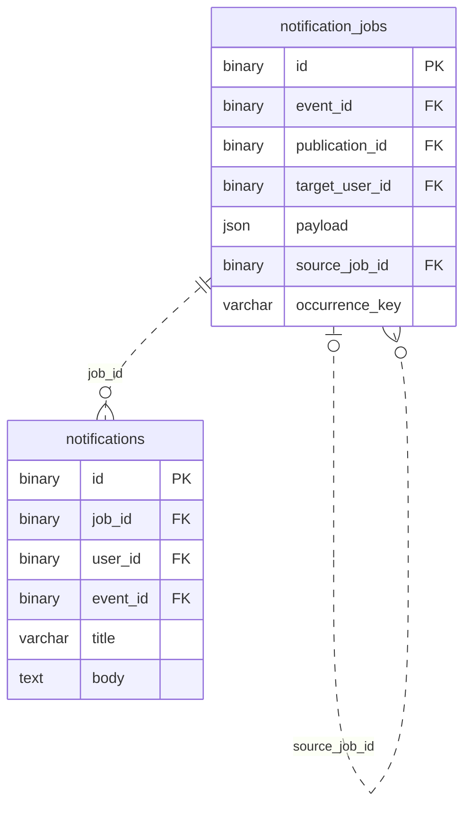

# 알림 ERD

[전체 ERD](../../../README.md#erd) · [도메인 목록](../README.md#도메인별-erd) · [ERDCloud](https://www.erdcloud.com/d/vuDvgmGQcvHf6f6g9)

알림 생성 작업과 사용자 알림에 해당하는 테이블을 정리했습니다.

## 테이블

| 테이블 | 역할 |
| --- | --- |
| [`notification_jobs`](../../../storage/db/src/main/resources/db/migration/notification/V010__create_notification_tables.sql#L4) | 알림 생성 작업과 재시도 상태 |
| [`notifications`](../../../storage/db/src/main/resources/db/migration/notification/V010__create_notification_tables.sql#L30) | 사용자 알림과 읽음·모의 발송 상태 |

## 관계도

이 도메인의 PK·FK와 일부 주요 컬럼, 내부 FK 관계를 요약했습니다. 전체 컬럼·UNIQUE·CHECK는 아래 SQL을 확인합니다.

## 다른 도메인과의 연결

FK가 있는 테이블에서 참조하는 테이블 방향으로 표시합니다. 테이블 이름을 누르면 해당 도메인으로 이동합니다.

| FK가 있는 테이블 | FK 컬럼 | 참조 테이블 | 참조 컬럼 |
| --- | --- | --- | --- |
| `notification_jobs` | `event_id` | [`events`](event.md) | `id` |
| `notification_jobs` | `publication_id` | [`publications`](drawing.md) | `id` |
| `notification_jobs` | `target_user_id` | [`users`](user.md) | `id` |
| `notifications` | `user_id` | [`users`](user.md) | `id` |
| `notifications` | `event_id` | [`events`](event.md) | `id` |

## 스키마 원본

- [Flyway SQL](../../../storage/db/src/main/resources/db/migration/notification/V010__create_notification_tables.sql): 실제 DB 적용 기준
- [통합 DBML](../schema.dbml): 전체 컬럼과 FK 관계

[← 추첨·발표](drawing.md) · [감사 로그 →](audit.md)

[전체 ERD](../../../README.md#erd) · [도메인 목록](../README.md#도메인별-erd) · [ERDCloud](https://www.erdcloud.com/d/vuDvgmGQcvHf6f6g9)
