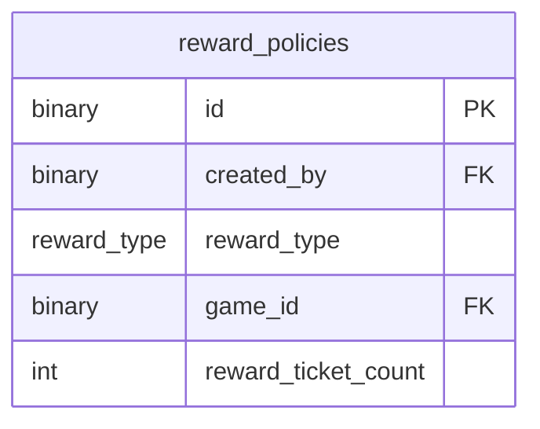

# 보상 정책 ERD

[전체 ERD](../../../README.md#erd) · [도메인 목록](../README.md#도메인별-erd) · [ERDCloud](https://www.erdcloud.com/d/vuDvgmGQcvHf6f6g9)

출석·미션·게임의 보상 정책에 해당하는 테이블을 정리했습니다.

## 테이블

| 테이블 | 역할 |
| --- | --- |
| [`reward_policies`](../../../storage/db/src/main/resources/db/migration/reward/V002__create_reward_tables.sql#L7) | 보상 유형·수량·적용 기간 |

## 관계도

이 도메인의 PK·FK와 일부 주요 컬럼, 내부 FK 관계를 요약했습니다. 전체 컬럼·UNIQUE·CHECK는 아래 SQL을 확인합니다.

## 다른 도메인과의 연결

FK가 있는 테이블에서 참조하는 테이블 방향으로 표시합니다. 테이블 이름을 누르면 해당 도메인으로 이동합니다.

| FK가 있는 테이블 | FK 컬럼 | 참조 테이블 | 참조 컬럼 |
| --- | --- | --- | --- |
| [`mission_reward_claims`](mission.md) | `reward_policy_id` | `reward_policies` | `id` |
| `reward_policies` | `game_id` | [`games`](game.md) | `id` |
| `reward_policies` | `created_by` | [`users`](user.md) | `id` |
| [`missions`](mission.md) | `reward_policy_id` | `reward_policies` | `id` |
| [`mission_submissions`](mission.md) | `reward_policy_id` | `reward_policies` | `id` |
| [`attendance_reward_claims`](attendance.md) | `reward_policy_id` | `reward_policies` | `id` |
| [`game_reward_claims`](game.md) | `reward_policy_id` | `reward_policies` | `id` |

## 스키마 원본

- [Flyway SQL](../../../storage/db/src/main/resources/db/migration/reward/V002__create_reward_tables.sql): 실제 DB 적용 기준
- [통합 DBML](../schema.dbml): 전체 컬럼과 FK 관계

[← 게임](game.md) · [응모권 →](ticket.md)

[전체 ERD](../../../README.md#erd) · [도메인 목록](../README.md#도메인별-erd) · [ERDCloud](https://www.erdcloud.com/d/vuDvgmGQcvHf6f6g9)
