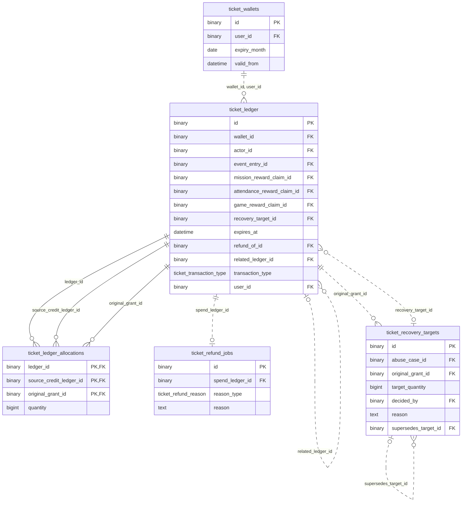

# 응모권 ERD

[전체 ERD](../../../README.md#erd) · [도메인 목록](../README.md#도메인별-erd) · [ERDCloud](https://www.erdcloud.com/d/vuDvgmGQcvHf6f6g9)

지갑·원장·배분·반환·회수에 해당하는 테이블을 정리했습니다.

## 테이블

| 테이블 | 역할 |
| --- | --- |
| [`ticket_wallets`](../../../storage/db/src/main/resources/db/migration/ticket/V008__create_ticket_tables.sql#L7) | 사용자별 만료월 지갑과 잔액 |
| [`ticket_ledger`](../../../storage/db/src/main/resources/db/migration/ticket/V008__create_ticket_tables.sql#L25) | 응모권 거래 원장 |
| [`ticket_ledger_allocations`](../../../storage/db/src/main/resources/db/migration/ticket/V008__create_ticket_tables.sql#L66) | 거래별 응모권 지급 출처와 배분 수량 |
| [`ticket_refund_jobs`](../../../storage/db/src/main/resources/db/migration/ticket/V008__create_ticket_tables.sql#L78) | 응모권 반환 작업과 재시도 상태 |
| [`ticket_recovery_targets`](../../../storage/db/src/main/resources/db/migration/ticket/V008__create_ticket_tables.sql#L94) | 부정 획득분 회수 결정과 근거 |

## 관계도

이 도메인의 PK·FK와 일부 주요 컬럼, 내부 FK 관계를 요약했습니다. 전체 컬럼·UNIQUE·CHECK는 아래 SQL을 확인합니다.

## 다른 도메인과의 연결

FK가 있는 테이블에서 참조하는 테이블 방향으로 표시합니다. 테이블 이름을 누르면 해당 도메인으로 이동합니다.

| FK가 있는 테이블 | FK 컬럼 | 참조 테이블 | 참조 컬럼 |
| --- | --- | --- | --- |
| `ticket_wallets` | `user_id` | [`users`](user.md) | `id` |
| `ticket_ledger` | `actor_id` | [`users`](user.md) | `id` |
| `ticket_ledger` | `event_entry_id` | [`event_entries`](event.md) | `id` |
| `ticket_ledger` | `mission_reward_claim_id` | [`mission_reward_claims`](mission.md) | `id` |
| `ticket_ledger` | `attendance_reward_claim_id` | [`attendance_reward_claims`](attendance.md) | `id` |
| `ticket_ledger` | `game_reward_claim_id` | [`game_reward_claims`](game.md) | `id` |
| `ticket_recovery_targets` | `abuse_case_id` | [`abuse_cases`](abuse.md) | `id` |
| `ticket_recovery_targets` | `decided_by` | [`users`](user.md) | `id` |
| `ticket_ledger` | `user_id` | [`users`](user.md) | `id` |

## 스키마 원본

- [Flyway SQL](../../../storage/db/src/main/resources/db/migration/ticket/V008__create_ticket_tables.sql): 실제 DB 적용 기준
- [통합 DBML](../schema.dbml): 전체 컬럼과 FK 관계

[← 보상 정책](reward.md) · [어뷰징 검토 →](abuse.md)

[전체 ERD](../../../README.md#erd) · [도메인 목록](../README.md#도메인별-erd) · [ERDCloud](https://www.erdcloud.com/d/vuDvgmGQcvHf6f6g9)
