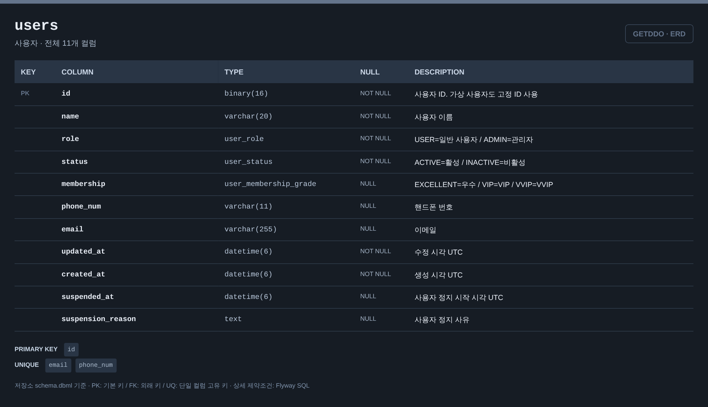

# 사용자 ERD

[전체 ERD](../../../README.md#erd) · [도메인 목록](../README.md#도메인별-erd) · [ERDCloud](https://www.erdcloud.com/d/vuDvgmGQcvHf6f6g9)

사용자 정보·역할·멤버십에 해당하는 테이블을 정리했습니다.

## 테이블

| 테이블 | 역할 |
| --- | --- |
| [`users`](#users) | 사용자 정보, 역할, 멤버십 |

## 테이블 이미지

저장소 DBML의 전체 컬럼·자료형·키·설명을 캡처한 이미지입니다. 이미지를 누르면 원본 크기로 볼 수 있습니다.

### users

## 다른 도메인과의 연결

FK가 있는 테이블에서 참조하는 테이블 방향으로 표시합니다. 테이블 이름을 누르면 해당 도메인으로 이동합니다.

| FK가 있는 테이블 | FK 컬럼 | 참조 테이블 | 참조 컬럼 |
| --- | --- | --- | --- |
| [`user_game_stats`](game.md#user_game_stats) | `user_id` | `users` | `id` |
| [`ticket_wallets`](ticket.md#ticket_wallets) | `user_id` | `users` | `id` |
| [`game_plays`](game.md#game_plays) | `user_id` | `users` | `id` |
| [`event_participants`](event.md#event_participants) | `user_id` | `users` | `id` |
| [`mission_reward_claims`](mission.md#mission_reward_claims) | `user_id` | `users` | `id` |
| [`current_awards`](drawing.md#current_awards) | `user_id` | `users` | `id` |
| [`reward_policies`](reward.md#reward_policies) | `created_by` | `users` | `id` |
| [`missions`](mission.md#missions) | `created_by` | `users` | `id` |
| [`banners`](event.md#banners) | `created_by` | `users` | `id` |
| [`attendances`](attendance.md#attendances) | `user_id` | `users` | `id` |
| [`mission_submissions`](mission.md#mission_submissions) | `user_id` | `users` | `id` |
| [`award_cancellations`](drawing.md#award_cancellations) | `canceled_by` | `users` | `id` |
| [`events`](event.md#events) | `created_by` | `users` | `id` |
| [`notification_jobs`](notification.md#notification_jobs) | `target_user_id` | `users` | `id` |
| [`notifications`](notification.md#notifications) | `user_id` | `users` | `id` |
| [`event_entries`](event.md#event_entries) | `user_id` | `users` | `id` |
| [`publications`](drawing.md#publications) | `published_by` | `users` | `id` |
| [`publications`](drawing.md#publications) | `updated_by` | `users` | `id` |
| [`draw_runs`](drawing.md#draw_runs) | `executed_by` | `users` | `id` |
| [`abuse_cases`](abuse.md#abuse_cases) | `user_id` | `users` | `id` |
| [`abuse_cases`](abuse.md#abuse_cases) | `reviewed_by` | `users` | `id` |
| [`audit_logs`](audit.md#audit_logs) | `actor_id` | `users` | `id` |
| [`ticket_ledger`](ticket.md#ticket_ledger) | `actor_id` | `users` | `id` |
| [`attendance_streaks`](attendance.md#attendance_streaks) | `user_id` | `users` | `id` |
| [`quiz_question_progress`](mission.md#quiz_question_progress) | `user_id` | `users` | `id` |
| [`attendance_streak_policy_sets`](attendance.md#attendance_streak_policy_sets) | `created_by` | `users` | `id` |
| [`attendance_reward_claims`](attendance.md#attendance_reward_claims) | `user_id` | `users` | `id` |
| [`game_reward_claims`](game.md#game_reward_claims) | `user_id` | `users` | `id` |
| [`ticket_recovery_targets`](ticket.md#ticket_recovery_targets) | `decided_by` | `users` | `id` |
| [`ticket_ledger`](ticket.md#ticket_ledger) | `user_id` | `users` | `id` |

## 스키마 원본

- [Flyway SQL](../../../storage/db/src/main/resources/db/migration/user/V001__create_user_tables.sql): 실제 DB 적용 기준
- [통합 DBML](../schema.dbml): 전체 컬럼과 FK 관계

[이벤트·응모 →](event.md)

[전체 ERD](../../../README.md#erd) · [도메인 목록](../README.md#도메인별-erd) · [ERDCloud](https://www.erdcloud.com/d/vuDvgmGQcvHf6f6g9)
